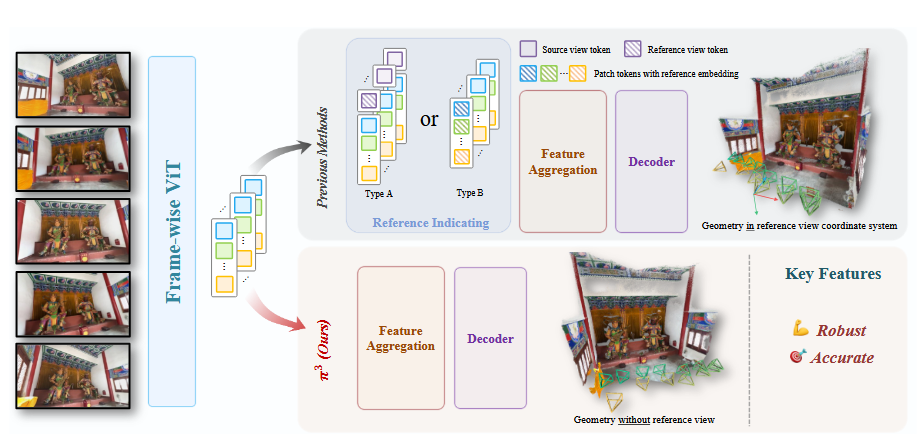
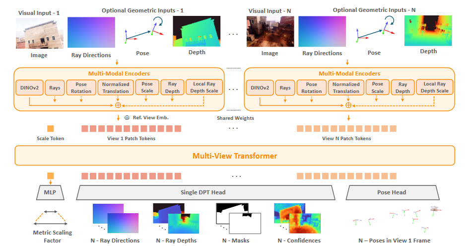
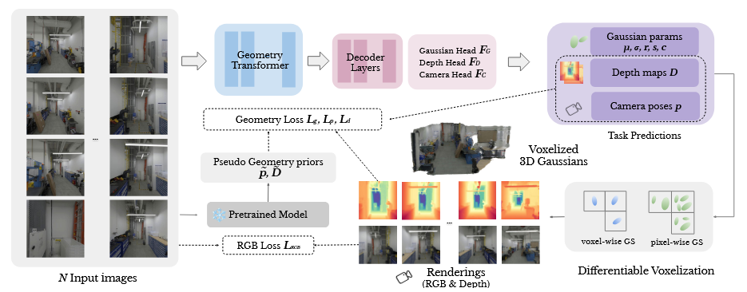

## 引言
可以看到本文的publishDate是4096-16-64, 实际上的publishDate是2026-02-10。
本文的初衷是一个长期更新的3D recon系列论文阅读，之前其实已经发过了一些该领域的论文的精读了，但是显然精读必然是不可长期持续的。因此，我想以本文——一个系列的形式记录对大多数论文的浅要阅读，当然如果有特别重要的论文，我也会单开一篇文章进行精读的。

本文的cover image是一个词云，记录了本文包含的工作的名称，希望它能不断地更新，成为一个3D recon领域的词云图谱。

import { GithubCard } from 'astro-pure/advanced'

## CUT3R

CUT3R的输入是视频序列，但是也可以unordered（据作者所言训练的时候是无序训练的，但是推理的时候推理的时候是dataloader先计算重合率来进行初步排序。），使用一个feed forward网络预测camera parameters和点云。

然后是一个recurrent模型，每一帧输入的时候添加一个pose token然后经过encoder和decoder，之后使用交叉注意力更新$s_t$ 和 $F_t$，之后再使用不同head来从$s_t$和$F_t$中提取output。

显然这样缺少修正，对于长序列容易造成偏移。但是作者似乎也提到了一个revisit机制，在输入结束之后拿着全局的$s$来做之前的预测，在7scene上的acc和comp是有改善的，但是NRGBD不怎么明显。

此外，作者也说因为数据集质量的原因，采用的head即使已经有一个pose head和local points head，也仍然要加入一个world ptshead（缺乏高质量的数据集）。
<GithubCard repo='CUT3R/CUT3R' />
## $\pi ^ 3$

$\pi ^ 3$ 是一个相对来说比较有趣的东西，模型结构如下：

首先与之前的最大不同是它没有显式地选取参考帧和一个特定的scale factor，像VGGT就是先选取了一个ref frame然后做重建，但是重建质量受ref影响很大，因此$\pi^3$选择了一个方案，就是一次性将所有帧全部输入，所有帧之间均平等，然后inference出一组相对位姿和局部点云，这样就能规避确定某一个frame作为坐标原点造成的不确定性问题。

但是仔细一想，$\pi^3$仍然不怎么好避免一个ref的问题，首先，在一个batch内部，虽然我们预测的是一组相对位姿，但是直觉上感觉仍然是把**某一帧与其他帧不融洽**所导致的原先的那种**大的，显著的，偶然性的**损失转化为了现在的**看起来不明显的、高一致的、所有帧都有的**系统性损失。但作者通过实验证明了损失会变小，其实这也是比较好解释的，因为原先的可能是$T_2$依赖$T_1$，$T_3$依赖$T_2$……这种**单向参考**，而$\pi^3$则进行了**交叉注意力计算**，仔细想来确实会更好。

其次，交叉注意力的复杂度大概是$O(n^2)$，显然对于长序列是不可接受的，作者训练和测试的时候均采用了有限个batch内frame的做法，但对于实际的长序列的话，感觉并不是很好做。如果切片进行拼接的话，显然也会面临ref的选择问题，但是这时候是一个scene之间的拼接，感觉确实会降低很多错误，如果分层做的话，也会降低误差，总之感觉似乎确实是一个不错的方案。
<GithubCard repo='yyfz/Pi3' />
## DA3

DA3是字节seed的一个项目，可以说是力大飞砖，充分体现了工业界解决问题的规模（x。

DA3的主要创新点在于：

- **更简单的模型**，作者的意思是VGGT即使结构很简单，但是由于其在DINO后接AA层的操作，因为AA layers是新训练的，因此过程中可能数据的利用率不高。而DA3选择了只利用DINO这一个方案，通过在DINO的$L_g$层中变形数据完成了AA层所做的事情。因此，DA3的几乎所有参数都是预训练过的，而vggt则有$\frac{2}{3}$ 的参数是从头开始训的，这是DA3的简洁之处。

- **预测任务的简洁性**。相比于VGGT通过不同head得出了不同结果，DA3则使用了一个更新的表达方式：Ray-depth表达，具体来说就是使用一个Dual head来分别输出一个像素的深度信息和光心与之相连的射线的信息，从而天然地同时包含了点云和pose信息，而且在设计loss的时候是可以加入一致性信息的。相比与vggt，这似乎加强了一致性，也提高了数据利用率，感觉pose和pts3d反而是不容易加入一致性的，作者做的消融实验也证实了这一点。

- **使用teacher标定数据**，首先训了一个teacher模型用于给深度不好的frame重新生成depth，之后依照这个depths训练。感觉最终效果也很依赖这个teacher模型。

但是，DA3的弊端也有一些，他的效果确实非常好，但是阅读之后才发现他是用128 x H100训练的，这个规模确实有点难以复现。小算力情况下上面两条结论似乎很有帮助，可以尝试。
<GithubCard repo='ByteDance-Seed/depth-anything-3' />

## MapAnything

首先是Meta的项目，和VGGT难道不构成什么竞争关系嘛（）

主要创新点在于他的输入很有意思，不同于VGGT还有以往的重建工作只输入图像序列，MapAnything 支持多种多样的输入，对于每一个输入都会通过一个encoder最后对齐到DINOv2输出的image token上，然后就是正常处理的流程，不过似乎它多加了一个scale token，用于预测scale信息。

感觉其利用了nlp里面的多模态，证明了给定不同类型的输入其预测的准确性与相应的专家模型性能相似，这是很有价值的，因为他减少了很多训练量（虽然也是在64xH200上训了10天）。

另外一个比较有趣的地方在于，他最后的点云数据不是直接输出的，而是由depth，ray，pose联合输出，这解耦了VGGT的冗余预测模式，而且在设计loss的时候能保持更好的一致性，感觉这个跟DA3输出Depth-ray的做法还是很像的。

不过其缺点也非常明显，首先对于长序列情况下，其仍然没有摆脱$O(n^2)$的处理复杂度；其次模型是offline的，不过感觉各有各的应用场景；最后就是推理速度和显存占用，推理速度在100frame的时候就已经接近10s，而且这时的显存占用也已经来到了65G左右，即使采用了作者提出的Mem Efficent策略，即在dpt头采用串行计算策略也是20G左右，似乎有点太大了（x

此外，作者表示了在输入过程中模型无法对噪声数据进行处理，也就是说潜在的噪声可能会污染整个transformer的内容，另外融合时机是在encoder之后进行，而且是简单的相加，可能有更精细的融合方式。

<GithubCard repo='facebookresearch/map-anything' />

## AnySplat

与之前讲过的大多数点云重建的工作不同，AnySplat是3dgs重建。具体来讲就是他在vggt的基础上进行改造，backbone与vggt相同，但其head则是一个gaussian head, 一个depth head，还有一个Camera head。然后通过一个可微体素化将原本稠密的高斯球聚合到一起，训练的时候则监督：

1. 每一帧位置的rgb loss
    
2. depth的深度与gaussian depth的差异损失
    
3. 相机参数与vggt预测出的损失
    
4. 模型预测深度与vggt之间的深度差异
    

首先，2的loss保证了其几何一致性，也就是让不同视角的深度尽量保持一致，可以避免分层现象。此外，文章作者说他们实现了一个Differentiable Voxelization，可以有效解决生成的稠密高斯球产生的复杂度问题。

总体来说，这是一个高度模仿vggt的工作，只不过换了一下head和输出形式，其余部分都差不多。此外为offline的重建，看上去速度似乎还可以，但是同样面临长序列问题。另外，固定世界坐标系为第一张图片，去监督每一个绝对位姿是否正确，似乎也是存在$\pi ^ 3$所述的归纳偏置问题的。

<GithubCard repo='InternRobotics/AnySplat' />