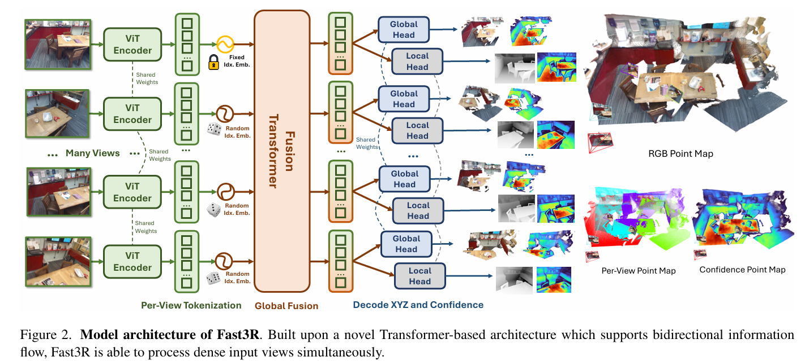
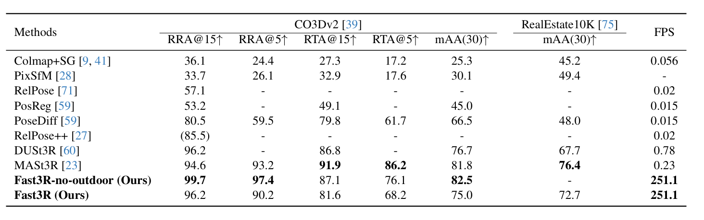

## 引言
OK,本人昨天又读了一篇3D reconstruction方向的论文：[Fast3R: Towards 3D Reconstruction of 1000+ Images in One Forward Pass](https://arxiv.org/abs/2501.13928)，因此写下此篇Blog分享自己的理解与发现。

Fast3R从本质上来说感觉和SLAM3R解决的是一类问题，都是对原本DUst3R存在的局限性：一次只能对两张图片进行处理，如果对多张图片进行处理的话，DUst3R则是选择进行两两配对进行重建，最后进行全局坐标下的对齐，显然这将会是一个
$\mathcal{O}(N^{2})$的过程。而Fast3R提出了对于**打乱序列的多张图片（1000+）**的处理方法，SLAM3R则是解决了由**视频**进行重建的方法。感觉两者的本质上的区别就是input的图像集是否有序，后续两者的网络结构区别也正是在此。

从论文的introduction上来看，他们主要做了以下三方面的贡献：
- 创建了Fast3R，一个基于Transformer的对多目图片重建点图的端到端的模型，据论文所述，它在速度上取得显著提升，并且可以规模化计算。
- 展示了随着训练时视角增多，模型表现也会加强。另外，当推理时视角增多时，每张视角重建结果的精确度也会提升。并且模型可以处理比训练时多得多的模型。
- 在相机的位姿定位上达到了**SOTA**水平，另外也展现出了极快的速度。

好的，现在到了我们喜闻乐见的介绍模型环节啦！

## 模型
Fast3R给出了一个看起来在推理环境就很庞大的结构图：

### 问题定义
从图中右边就可以看到，Fast3R采用了两个头：Global Head 和 Local Head来处理输出的token，因此可见，Fast3R为每张图片预测了两个点图：本地坐标系下的点图$X_L$和全局坐标系下的点图$X_G$，可以用公式表示：
$$
\mathrm{Fast3R}:\mathbf{I}\to(\mathbf{X}_\mathrm{L},\Sigma_\mathrm{L},\mathbf{X}_\mathrm{G},\Sigma_\mathrm{G})
$$
$\Sigma_X$指代的是$X$点图的置信度。

值得注意的是，全局坐标系值得是第一张图片的坐标系，本地坐标系是每个对应图片的坐标系。（虽然Fast3R并没有次序的概念，但其也需要一个切入点，所以随机选取了一张图片作为第一张图片）

### 训练对象
类似于Dust3R，Fast3R的损失函数分别采用了同样的处理方法处理本地点图和全局点图两部分：
$$
\mathcal{L}_\mathrm{total}=\mathcal{L}_\mathrm{X_G}+\mathcal{L}_\mathrm{X_L}
$$
阅读其论文，发现其与Dust3R的损失函数基本一致，因此不多赘述。

### 模型架构

#### Image Encoder
由上图所示，我们可以看到每一个输入的图片都会经过一个共享权重的Vit Encoder生成对应的token序列 $H_i = \{h_{ i , j }\}_{j = 1}^{HW/P^2}$，即：
$$
H_i=\mathcal{F}(I_i),i\in1,...,N
$$
论文中提到，他们使用了和Dust3R相同的Encoder：CroCo ViT，但是他们提到了DINOv2的表现与之相似。

另外，在把token传入fusion transformer之前，作者为每一个token添加了一个一维的位置编码，目的是让模型知道哪些图像块来自于同一张图片，并且帮助模型认出上文标定的第一张图片。这同样也能让模型隐式地去理解这些图片里反映的相机位姿。

#### Fusion Transformer
模型中大多数计算都发生在Fusion Transformer里面，作者使用了一个类似于**ViT-L**的24层的transformer作为这一模块的主体。它将来自所有的视角的token作为输入，并且通过全连接的自注意力机制进行处理，使的模型能够理解所有视角的信息，远超Dust3R能理解的两个视角的信息。

#### Pointmap Decoding Heads
最后，Fast3R使用了两个独立的DPT解码头将Fusion Transformer的输出解码为点图，即图片中右边部分。

#### 位置编码
论文最后的目标是进行多图片处理，并且实现推理时的可以处理的图片数量远远多于训练时的图片数量，因此我们就要考虑推理时为token嵌入位置编码的手段。

- 一开始，文章尝试使用相同的球谐函数嵌入编码，文章中又提到：在LLM中，这种方法导致性能不佳。果不其然，在文章的初步实现中，他们同样发现当输入图像数量超过训练时使用图像的数量时，模型的效果并不好。
- 因此，文章借鉴了大预言模型中的**位置插值**方法：在训练时从一个集合$\{1,...,N'\}$中**均匀随机**抽取$N$个索引，这样模型便被迫去学习处理**更大范围**的索引。

对于transformer来说，这种策略感觉和masking没什么区别，文章中也说：

> This strategy enables Fast3R to handle N = 1000 images during inference, even if only trained with N = 20 images.

## 有效利用显存
从模型架构的图片来看，这看起来就是一个占用很大显存的模型。但是文章提出，由于模型的特点（meta-architecture），这个模型可以广泛使用各种并行化以及分片技术。
文章提出他们在训练和推理的时候利用了两种不同形式的并行化和FlashAttention技术，并认为随着未来的技术成熟他们的模型会持续受益（废话）。

### 具体采用的策略来实现高效训练。
首先，使用FlashAttention来提高时间和内存效率。即便如此，当N>16时，一个朴素的实现即使在批量大小为1的情况下也会耗尽内存（128 x A100-80GB啊，离大谱）。
因此，后来使用了DeepSpeed ZeRO stage 2训练，将优化器状态、动量估计和梯度在不同的机器上进行分区。这样就能够以每个数据样本最多N=28个视角进行训练，同时每个GPU的批量大小为1。

## 模型效果：

就模型所给出的表格而言，确实是达到了Sota水平。

在推理速度上，由于所做的各种优化，它也得到了显著的提升。

但是，其实我更好奇的是它跟同期的SLAM3R的性能比较，阅读论文，发现两者并没有过同一个精度指标的比较，通过本人的本地测试，发现对于一个很小的数据集（82张有序图片），两者速度上并没有太多差距，但是重建质量上来说
，SLAM3R的质量远超Fast3R。这很好的符合了SLAM3R对有序图像序列进行针对性重建的特性，而fast3R是对一个随机图像重建的方法。

所以，当我看到Fast3R的demo里有对视频重建的选项时，我感觉并不适合。因为从直觉上来说，人们从一个没有次序的图像集中理解环境的过程也大致遵循一个先排序再重建的过程，也就是说人们对无次序的图片集中还原3D场景的难度远大于从视频中还原场景的难度。

论文中也提到了局限性的存在：
- 缺少包含大型场景的数据因而缺少在此类场景下的泛化能力。
- 没有更好的位置嵌入，不过论文提出可以参考那些能处理极长上下文序列的大语言模型。

ok，关于Fast3R我就处理到这里，欸，我觉着或许我以后应该认真去看看训练细节和实验部分，总去看模型结构有种高屋建瓴的感觉，还是应该多看看代码（x

import { GithubCard } from 'astro-pure/advanced'

<GithubCard repo='facebookresearch/fast3r' />