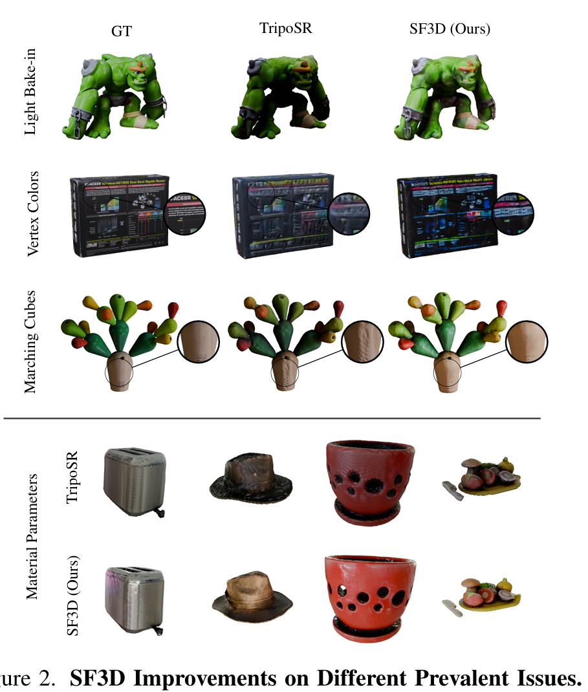
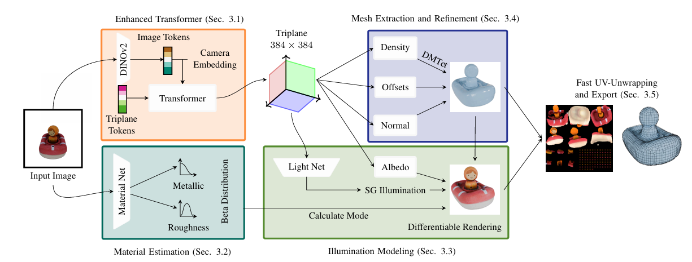
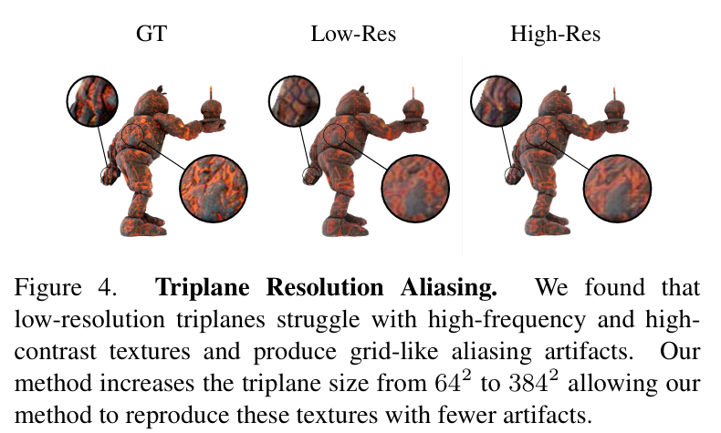
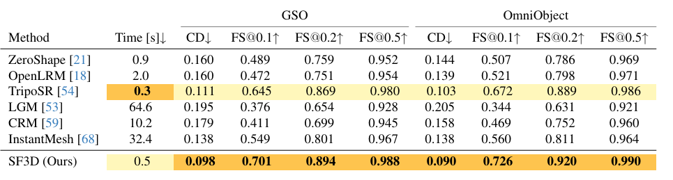
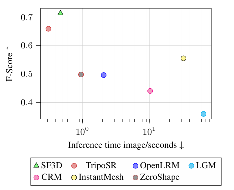

import { Spoiler } from 'astro-pure/user'

## 引言
mesh construction是我刚刚开始了解的一个方向, 今天读了[SF3D: Scene Fusion for 3D Reconstruction with Transformers](https://arxiv.org/pdf/2408.00653)这篇论文, 本文笔记记录用于后续翻阅学习。

读完这篇论文之后, 感觉mesh reconstruction与point cloud reconstruction还是有很大区别的, 尤其是这篇文章中引入的几个新的 mesh 专有的 module, 感觉要比 point cloud reconstruction 更加复杂一些.OK,
废话不多说, 直接进入正题.

## Introduction
作者一上来就提出了几个issue:

1. Light bake-in : 现有的模型将光照信息直接bake到texture里, 使得生成的mesh难以利用, 而在SF3D中, 作者提出了使用explicit illumination和一个不同的使用 Spherical Gaussian 的 shading model来解决这个问题(如上图第一行所示).
2. Vertex Coloring : 现有的工作中, 生成的vertex的数量过多, 使得性能开销很大. 作者认为一个关键问题就是 UV unwrapping的额外处理时间, 于是作者提出了一种highly parallelizable fast box projection-based UV
unwrapping method 来解决这个问题(如上图第二行所示), 这使得时间从10-30s 减少到了0.5s, 而且从图上来看, 细节比baseline的 TripoSR 的效果更好.
3. Marching Cube Artifacts : feed-forward network 通常生成类似与 Triplane NeRFs 的体素网格, 然后使用 marching cube 来提取mesh, 但是这种方法会引入一些artifacts, 
作者提出了使用一个对高分辨率 Triplane 更有效的 architecture, 并且使用 DMTet 来对生成的vetex diplacement 和 normal map生成最终的mesh, 这样可以有效减少marching cube引入的artifacts(如上图第三行所示).
4. Lack of Material Properties : 现有的工作生成的mesh在不同光照下都会看起来dull, 这是因为缺乏explicit的material properties.为解决这个问题, 作者预测了non-spartially varying material properties
(如上图第4, 5行所示).

通过以上的改进, SF3D 可以从单张图像生成高质量的mesh, 且生成的3D 资产体积小(1 MB)并且可以在0.5s内生成.

## Method 
为了解决上面提到的问题, 作者提出了 SF3D.

首先, SF3D是在TripoSR的基础上进行改进的. TripoSR训练了一个能够生成Triplane 3D representation的transformer. 它使用DINO encode image, 然后把token送入transformer中, transformer输出一个$64 \times 64$分辨率的
triplane, 然后triplane feature之后被decode为color和渲染成标准NeRF. TripoSR 只学到了colors并且不能处理反射等材质属性.

### Overview
SF3D的整体架构如下图所示:

可以看到, SF3D由5个主要模块组成:
1. Enhanced Transformer : 用于预测高分辨率的triplane feature.
2. Merterial Estimation : 用于预测材质属性.
3. Illumination Modeling : 处理光照问题.
4. Mesh extraction and refinement : 用于从triplane中提取mesh并进行细化.
5. UV Unwrapping and Export : 产生low-poly mesh 和 高分辨率 texture map.

### Enhanced Transformer
为了生成高分辨率的triplane feature, 作者对TripoSR的transformer进行了改进, 主要有以下几点:
- 首先, 作者将DINO 替换成了DINOv2, 这样可以获得更好的image feature.
- 其次, 作者对 triplane 导致的 aliasing 问题进行了讨论

如上图所示, 低分辨率的triplane会导致aliasing问题, 但是简单地提高triplane的分辨率会导致模型更复杂, 作者说, 他从PointInfinity中获得启发, 
(PointInfinity 提供了一个不需要计算triplane的self-attention的架构), 因此, 作者将分辨率提高到$96 \times 96$, 从而降低了走样.

### Material Estimation
SF3D 输出了 metallic 和 roughness 两个材质属性. 论文中提到, 理想状况下, 人们希望材质属性是spatially varying的, 但是这样并不现实. 于是作者简化了这个问题, 为整个物体
预测这两个属性, 作者提到虽然这种非空间变化的材质属性通常适用于同质物体, 但是实际上能显著改善渲染效果.

为了实现这个预测, 作者引入了一个 Material net, 首先将图像通过CLIP encoder编码, 然后通过2个MLP预测 metallic 和 roughness.

### Illumination Modeling

作者提出要显式estimating光照, 如果不这样做的话, 输出的RGB 颜色会将光照信息bake进去, 使得生成的mesh难以利用. 为此, 作者提出了一个 Light net, estimate SG 光照. 因为triplane encode了场景的几何信息, 所以可以能够推断光照变化.

具体实现上, 作者使用 Transformer 输出的 $96 \times 96$ 分辨率的triplane作为输入, 使其通过 2 个 CNN 层, 接着进行max pool, 
最后通过一个MLP。Light Net 输出 24 个 SG 的grayscale amplitude values, 并使用 Softplus 以确保值为正数。这些 SG 的轴和锐度值保持固定, 其设置旨在覆盖整个球体。
利用这些振幅值, 作者实施了一种类似于 NeRD [4] 中使用的deferred physically based rendering方法.

此外, 作者的方法在训练阶段还引入了一个lighting demodulation loss $\mathcal{L}_{\text{Demod}}$, 该损失函数旨在确保：一个具有entirely white albedo的物体上的光照, 
能与输入图像的亮度紧密匹配。lighting demodulation loss强制学习到的光照与训练数据中观察到的光照条件保持一致. 
这可以被视为一种bias, 用于解决appearance和shading之间的ambiguity.

### Mesh Extraction and Refinement
为了从triplane中提取mesh, 作者使用了DMTet. 作者提出了两个MLP head来预测vertex offsets和vertex normals. 这里受MeshLRM启发, 作者也单独使用了分离的decoder MLP来辅助这两个head的训练. 
作者发现, vertex offset能够反走样, 而vertex normal则能提升细节表现. 鉴于一开始normal map的预测不会太准确, 于是作者使用了slerp来稳定训练, 这是在一开始的5K step里发生.

然后引入了各种loss来训练这个mesh extraction and refinement模块:

- $$\mathcal{L}_{\text{Nrmconsistency}}$$ : 法线一致性损失
- $$\mathcal{L}_{\text{Laplacian}}$$ : Laplacian 平滑损失
- $$\mathcal{L}_{\text{Offset}} = v_o^2$$ : 顶点偏移正则化
- $$\mathcal{L}_{\text{Nrmrepl}} = 1 - n \cdot \hat{n}$$ : 法线复制损失
- $$\mathcal{L}_{\text{Nrmsmooth}} = (\hat{n}(x) - \hat{n}(x + \epsilon))^2$$ : 法线平滑损失

### UV Unwrapping and Export

SF3D模型的最终阶段是一个高效的导出流水线, 关键挑战在于传统UV展开的计算密集性, 这不符合快速生成的要求. 为此, 作者提出了一个基于立方体投影的展开方法. 该方法利用网格面法线独立决定投影方向, 实现了可并行化的展开过程. 
具体实现上, 该方法执行2D三角形-三角形相交测试来处理UV图集中的遮挡, 并根据深度和接近度对相交面进行重新分配. 同时, 通过遵循径向 $z$ 切线方向旋转UV岛以最小化阴影接缝. 接着, 通过UV展开将世界坐标和占用率烘焙到UV图集上
, 用于从triplane中查询反照率和表面法线. 为防止接缝伪影, 作者采用了一个迭代过程, 使用 $3 \times 3$ 部分卷积和最大池化来扩展UV边界, 确保纹理平滑向外混合. 

之后, 作者将所有文件作为glb格式导出.

## Overall Training and Loss Functions

由于直接在网格渲染任务上训练方法会产生不满意的结果, 作者首先在 NeRF 任务上进行了预训练. 完成预训练后, 模型过渡到网格训练, 
将 NeRF 渲染替换为differentiable mesh rendering和基于 SG 的着色.

分步的损失函数如下所示:
$$
\begin{split}\mathcal{L}_{\rm render}&=\underbrace{ \lambda_{\rm MSE}}_{ 1 0}\mathcal{L}_{\rm MSE}+\underbrace{ \lambda_{\rm LPIPS}}_{ 2}\mathcal{L}_{\rm LPIPS}+\underbrace{\lambda_{ \rm Mask}}_{ 1 0}\mathcal{L}_{\rm Mask}\\ \mathcal{L}_{\rm mesh}&=\underbrace{\lambda_{\rm Laplacian }}_{ 0.01}\mathcal{L}_{\rm Laplacian}+\underbrace{\lambda_{\rm Nrm Consistency}}_{ 0.001}\mathcal{L}_{\rm Nrm consistency}+\underbrace{\lambda_{\rm Offset}}_{ 0.1}\mathcal{L}_{\rm Offset}\\ \mathcal{L}_{\rm shading}&=\underbrace{\lambda_{\rm Nrm repl}}_{ 0.2}\mathcal{L}_{\rm Nrm repl}\underbrace{\lambda_{\rm Nrm smooth}}_{ 0.02}\mathcal{L}_{\rm Nrm smooth}+\underbrace{\lambda_{\rm Demod}}_{ 0.01}\mathcal{L}_{\rm Demod}\end{split}
$$
总损失为:
$$
\mathcal{L}=\mathcal{L}_{\rm render}+\mathcal{L}_{\rm mesh}+\mathcal{L}_{\rm shading}
$$

## Results 
作者在GSO和OminiObject3D数据集上对SF3D进行了评估. 结果如下图所示:

可以看到, SF3D在视觉效果上明显优于其他方法, 并且在数值指标上也有显著提升.

在速度方面, 确实如作者所说, SF3D的UV展开非常快, 只需0.5s, 远快于其他方法的10-30s.

## Conclusion
因此, 我似乎大致总结完了SF3D的主要结构, 从一张图像生成高质量的mesh, 能不能对视频进行这样的操作呢? 我们看到这个任务里实际上用了大量生成的先验知识, 我在想一个完全
基于image的3D reconstruction方法, 能不能做到不依赖于这些先验知识? 