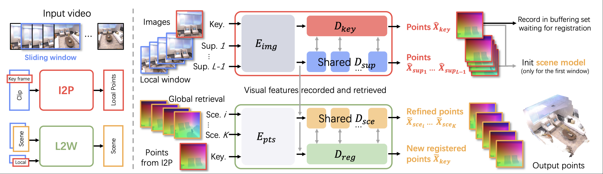
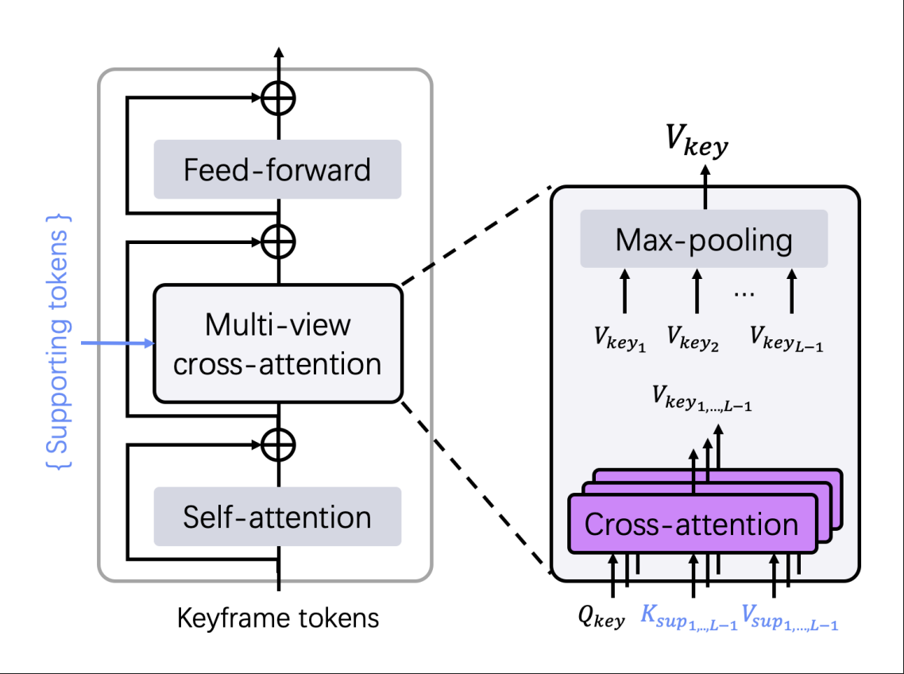

最近几天读完了[SLAM3R](https://github.com/PKU-VCL-3DV/SLAM3R)的论文，这是2025年CVPR的一 篇**Highlight**论文，也是我在3R方向的读过的第3篇论文。

这篇论文主要介绍了一个叫做**SLAM3R**的根据视频即时重建的系统，感觉是由**DUst3R**中获得的灵感，不同的是**DUst3R**是根据两张图片重建出三维点图，并且是离线处理；而**SLAM3R**是从一个单目视频中实时在线重建，并且相较于之前的一些方法具有极高的效率。

## SLAM3R的主要模块
SLAM3R主要由**I2P**和**L2W**两大模块组成，分别负责从视频中的关键帧重建点图(Image to Point)和利用点图增量式地重建全局点图（Local to World）,具体结构如下：

### 视频预处理
首先，SLAM3R采用了滑动窗口算法将视频拆成多个小片段，把多个小片段输入到I2P中进行处理。

### I2P网络
I2P模块接受预处理产生的视频片段，该视频片段由多个帧$\{F_i\},i = 1, ... N$组成。通常我们从中选取最中间的帧作为关键帧$F_{key}$，剩下的$N - 1$个帧作为补充帧输入到I2P中。

首先，我们将所有帧通过一个由$m$个ViT encoder组成的$E_{img}$，生成相应的token，然后再进行decoder操作。具体就是将关键帧的token输入到一个特殊处理的decoder:$D_{key}$里（如下图所示），然后剩下的$N - 1$个补充帧共享同一个decoder结构（继承自**DUst3R**，由$n$个ViT decoder组成），均生成对应的$G_{sup_i}$。

然后，我们再使用类似于**DUSt3R**中的方法，将这些帧（尤其是关键帧）做出一个置信度最高的三维重建。从而得到某一个视频片段对应的点图$\hat{X}_{key}$。

### L2W网络

这个模块接受I2P模块产生的$X_{key}$作为输入，因为其是一个在线处理方法，所以我们引入了缓冲集这一关键的组分。

首先，我们在已经处理完的关键帧点图中采用`reservoir strategy`选取$B$个已经注册完的帧作为缓冲集（对于第一个帧这种特殊情况，我们采用了重复运行多次I2P获取足够多数量的初始帧作为缓冲集），然后，每当一个新的帧输入时，我们使用一个检索模块（由I2P中的decoder组成）在缓冲集中将特征的相似度进行匹配，我们然后选取匹配度最高的$K$个关键帧点图，然后将这$K$个关键帧点图 $$ \hat{X}_{i}^{H \times W \times 3},i = 1 , ..., K + 1 $$作为这个模块的输入。

如前图所示，我们将这$K + 1$个点图输入到我们的L2W模块的encoder $E_{pts}$ 中：
$$
\mathcal{P}_i^{(T\times d)}=E_{pts}(\hat{X}_i^{(H\times W\times3)}),i=1,...,K+1.
$$
然后，由于我们实际上不能只通过点图信息来进行建模（如纹理相同的两个不一样的平面或不同的一块地面），因此我们选择将特征与I2P网络中的特征融合：
$$
\mathcal{F}_i^{(T\times d)}=F_i^{(T\times d)}+\mathcal{P}_i^{(T\times d)},i=1,...,K+1.
$$
在这之后，我们便生成了每张点图的位置外观特征序列。

紧接着，我们会这$K + 1$个点图输入到两个解码器中：

#### Registration Decoder
Registration Decoder将所有token作为输入，然后目的是将L2W的关键帧重建转换到场景坐标系下，它与$D_{key}$采用相同的架构。

解码过程大概是：
$$
\mathcal{G}_{sce_i}=D_{sce}(\mathcal{F}_{sce_i},\mathcal{F}_{key}),\quad i=1,...,K
$$

#### Scene Decoder
Scene Decoder同样将所有token作为输入，但是它的目的是在不改变场景坐标系的情况下，精化坐标几何。他同样采用与$D_{key}$相同的架构，但是他是对每一个在已选中的关键帧点图进行优化：
$$
\mathcal{G}_{sce_i}=D_{sce}(\mathcal{F}_{sce_i},\mathcal{F}_{key}),\quad i=1,...,K
$$
通过这样的方式将已生成的point map进行优化

最后，我们采用类似于I2P模块中的方法对我们所有已经重建的关键帧token进行点图重建：
$$
\tilde{X}_i^{(H\times W\times3)},\tilde{C}_i^{(H\times W\times1)}=\mathrm{H}(\mathcal{G}_i^{(T\times d)}),i=1,...,K+1.
$$

得到一个实时的三维表示。

## 结论
本人目前涉猎不深，但是论文最后与其他系统做比较，其展现的效率确实令我印象深刻，感觉以上的这个系统的两大模块也令非常简洁舒适。等我再去阅读其他的3R文章来进一步理解这个SOTA的含金量吧😋

github项目地址：

import { GithubCard } from 'astro-pure/advanced'

<GithubCard repo='PKU-VCL-3DV/SLAM3R' />

喵喵又是充实的一天🥳，本人可能理解有偏差（bushi