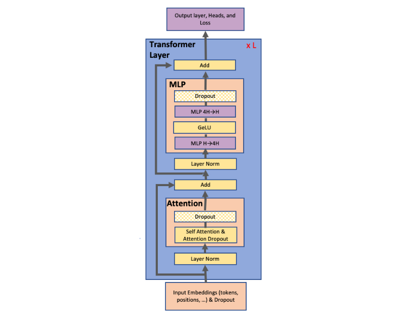
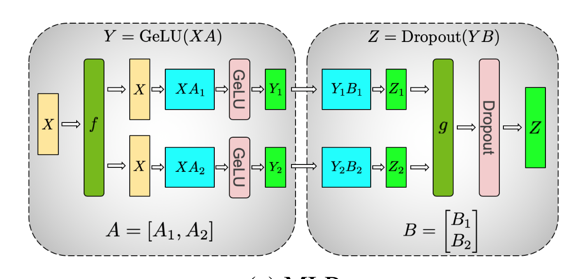

# 引言

经历了一些对未来选择的思考之后，最近在了解mlsys相关的内容，本文即为对TP的理解和总结，目前网上已经有大量的博文详细介绍了TP的实现细节，本文主要是为了自己未来查阅方便而写的文章，欢迎大家指正。

# TP简介
Tensor Parallelism是在DP, MP之后提出的一个方法，由Magatrion-LM首创。其出发点在于DP, MP仍然需要单卡在计算时凑齐一个完整的layer的参数和各种激活值、梯度、优化器状态，当一个layer过大的时候，单卡就放不下了。
而Tensor Parallelism将模型的计算拆成分布式的了，使得一层能够分布于不同卡上进行计算。

## Transformer-like model
一个经典的Transformer 模型的架构大致如下图：



可以看到，一个layer主要由Attention和MLP层组成，TP的关键优化点也就是在这两层上，下面将具体说明。


## MLP
我们先从MLP层开始，简而言之，一个MLP层的数学描述大致这样：

$$
\mathrm{Out} = \mathrm{Dropout}(\mathrm{GeLU}(X W_1) W_2)
$$

其中：

$$
\begin{aligned}
X &: (B, S, d_{\text{model}}) \\
W_1 &: (d_{\text{model}}, d_{\text{ff}}) \\
W_2 &: (d_{\text{ff}}, d_{\text{model}})
\end{aligned}
$$

一般来说，$d_{\text{ff}} = 4 \times d_{\text{model}}$

我们先考虑不进行TP，仅仅进行单卡计算：

### 单卡forward
参数量：

$$
\begin{aligned}
W_1 &: d_{\text{model}} \times d_{\text{ff}} \\
W_2 &: d_{\text{ff}} \times d_{\text{model}} \\
\text{总参数} &: 8 d_{\text{model}}^2
\end{aligned}
$$

计算量：

$$
\begin{aligned}
&\text{两个矩阵乘均贡献 } 2 \times B \times S \times d_{\text{model}} \times d_{\text{ff}} \\
&\mathrm{FLOPS} = 16 \times B \times S \times d_{\text{model}}^2
\end{aligned}
$$

激活量：在backward里考虑。

### 单卡backward

首先对dropout反向：

$$
\frac{\partial L}{\partial Z} = \frac{\partial L}{\partial \mathrm{Out}} \odot \frac{\mathrm{mask}}{1 - p}
$$

这一步的FLOPS差一个数量级，可忽略不计，另外使用 $LX$ 表示 $\partial L / \partial X$。

然后对 $W_2$ 进行反向：

$$
\begin{aligned}
LW_2 &= A^T \cdot LZ \\
LA &= LZ \cdot W_2
\end{aligned}
$$

其中 $A = \mathrm{GeLU}(\cdots)$。

这一步的FLOPS为 $2 \times (2 \times B S \, d_{\text{model}} \, d_{\text{ff}}) = 16 \, B S \, d_{\text{model}}^2$

GeLU的FLOPS几乎也可以忽略不计。

然后对 $W_1$ 进行反向，几乎与 $W_2$ 相同。

因此整个过程的FLOPS为 $32 \, B S \, d_{\text{model}}^2$，为前向传播的两倍。

然后我们从激活值占用角度分析，在没有梯度检查点的情况下，我们有：

```
X           (BS, d_model)       use for compute L_W1
H = XW_1    (BS, d_ff)          use for compute the gelu 
A = GeLU(H) (BS, d_ff)          use for compute L_W2 
Dropout mask(BS, d_model)       use for Dropout
```

### TP forward



我们进行这样的切分方式：
```python
W_1 -> (W_11, W_12, W_13, ... W_1n)  # W_1i : (d_model, d_ff / n) 
```
这样我们在输入X的时候全部注入，然后得到：
```python
H -> (XW_11, XW_12, XW_13, ... XW_1n) # XW_1i : (B, S, d_ff / n)
```
值得注意的是，我们选择按列切分 $W_1$ 使得我们得到的结果是可以独立通过gelu的，省去了这一步通信的麻烦。

之后考虑 $W_2$

我们选择将 $W_2$ 进行这样的切分：
```python
W_2 -> [
    W_21,
    W_22,
    W_23,
    ...
    W_2n 
]
```

之后，显然我们现在可以每张卡计算`XW_11 @ W_21`，而且他的形状就是最后矩阵的形状，
因此，我们算出来然后最后采用all reduce就可以得到最后结果啦。

ok，我们现在对这整个过程进行分析：

- 参数量：
    显然，我们现在把所有参数分散到了多卡上，而且分散均匀，

$$
\begin{aligned}
W_1 &: d_{\text{model}} \times d_{\text{ff}} \\
W_2 &: d_{\text{ff}} \times d_{\text{model}} \\
\text{总参数} &: 8 d_{\text{model}}^2 / n
\end{aligned}
$$

- 计算量：

$$
\begin{aligned}
&\text{两个矩阵乘均贡献 } 2 \times B \times S \times d_{\text{model}} \times d_{\text{ff}} / n \\
&\mathrm{FLOPS} = 16 \times B \times S \times d_{\text{model}}^2 / n
\end{aligned}
$$

    但是这里还要考虑一个问题，就是最后reduce-all操作还要对所有激活值进行累加，但是这部分数量级过小，可忽略。

- 激活量：在backward里考虑。

### TP backward

在每张卡上的前向是：

$$
Z^i = \mathrm{GeLU}(X W_1^i) W_2^i, \quad \text{AllReduce} \to Z = \sum_i Z^i
$$

由于AllReduce之后每张卡上的Z完全相同，所以上游传回的梯度也完全一样，不需要额外通信。

此后，每一步的计算基本上与单张卡相同，但是要除以 $N$。

因此，每张卡的反向FLOPS为：

$$
\mathrm{FLOPS} = 32 \times B S \, d_{\text{model}}^2 / N
$$

然后，之后需要注意的是我们在反向传播的最后仍然需要一步all-reduce，因为我们此前计算的都是独立的梯度。

激活值的占用：我们有：

```
X           (BS, d_model)       use for compute L_W1
H = XW_1    (BS, d_ff / N)          use for compute the gelu 
A = GeLU(H) (BS, d_ff / N)          use for compute L_W2 
Dropout mask(BS, d_model)       use for Dropout
```


## Attention

### 单卡forward

输入数据：
```python 
X       (B, S, d_model) 
X_h     (B, S, h, d_head)      W_Q  (h, d_head, d_Q)    W_K (h, d_head, d_K)    W_V(h, d_head, d_V)
# 注意到在单卡情况下我们这一步计算Q, K, V通常不做维度划分，但可以这么理解，方便后续对TP的理解
Q       (B, S, h, d_Q)      K   (B, S, h, d_K)      V   (B, S, h, d_V)
Q @ K.transpose  -> S   (B, h, S, S)
S @ V       ->      (B, h, S, d_V)
reshape -> (B, S, h *d_V)

# 接着引入一个W_O : (h * d_V, d_model)
O       (B, S, d_model)
```

ok，对整个过程清晰之后我们便可以分析其各个指标：

参数量：

$$
\begin{aligned}
W_Q &: h \times d_{\text{head}} \times d_Q \\
W_K &: h \times d_{\text{head}} \times d_K \\
W_V &: h \times d_{\text{head}} \times d_V
\end{aligned}
$$

通常来说这几个都相等，所以总参数为 $4 d_{\text{model}}^2$。

计算量：

| 操作 | 形状 | FLOPS |
|---|---|---|
| $X \to Q, K, V$ | $(BS, d_{\text{model}}) \times (d_{\text{model}}, d_{\text{model}})$ | $6 \, BS \, d_{\text{model}}^2$ |
| $Q K^T \to S$ | $(B, h, S, d_{\text{head}}) \times (B, h, d_{\text{head}}, S)$ | $2 \, BS^2 d_{\text{model}}$ |
| $SV \to AV$ | $(B, h, S, S) \times (B, h, S, d_{\text{head}})$ | $2 \, BS^2 d_{\text{model}}$ |
| $AV \cdot W_O$ | $(B, S, d_{\text{model}}) \times (d_{\text{model}}, d_{\text{model}})$ | $2 \, BS \, d_{\text{model}}^2$ |

因此，总的FLOPS为：

$$
8 \, BS \, d_{\text{model}}^2 + 4 \, BS^2 d_{\text{model}}
$$

需保存的激活值：

| Tensor | shape | num |
|---|---|---|
| $X$ | $(B, S, d_{\text{model}})$ | $BS \, d_{\text{model}}$ |
| $Q, K, V$ | $(B, S, d_{\text{model}})$ | $3 \, BS \, d_{\text{model}}$ |
| $S$ | $(B, h, S, S)$ | $BhS^2$ |
| $AV$ | $(B, h, S, d_{\text{head}})$ | $BS \, d_{\text{model}}$ |

### 单卡backward

首先我们做 $W_O$ 的反向：

$$
\begin{aligned}
LW_O &= (AV)^T \cdot LO \quad (d_{\text{model}}, S, B) \times (B, S, d_{\text{model}}) \\
LAV &= LO \cdot W_O^T \quad (B, S, d_{\text{model}}) \times (d_{\text{model}}, d_{\text{model}})
\end{aligned}
$$

加起来是 $4 \, BS \, d_{\text{model}}^2$

然后我们回到 $AV$：

$$
\begin{aligned}
LS &= LAV \cdot V^T \quad (B, h, S, d_{\text{head}}) \times (B, h, d_{\text{head}}, S) \\
LV &= S^T \cdot LAV \quad (B, h, S, S) \times (B, h, S, d_{\text{head}})
\end{aligned}
$$

这一步的FLOPS为 $4 \, BS^2 d_{\text{model}}$。

然后经过Softmax反向，FLOPS可以忽略，然后计算Q, K，FLOPS为 $4 \, BS^2 d_{\text{model}}$。

之后对 $W$ 做反向，权重梯度和输入梯度均为 $2 \, BS \, d_{\text{model}}^2$，共计为12。

因此，总反向FLOPS为：

$$
16 \, BS \, d_{\text{model}}^2 + 8 \, BS^2 d_{\text{model}}
$$

为前向的两倍，所以我们在这里也可以认为反向传播的FLOPS为前向的两倍。

## TP 
显然这时我们就可以完全将head分到多张卡上，所有的几乎均乘上一个 $\frac{1}{N}$ 即可。

但此时仍然需要注意的是，我们得到O之后仍然需要all-reduce，这与mlp是一样的。

先写到这里.