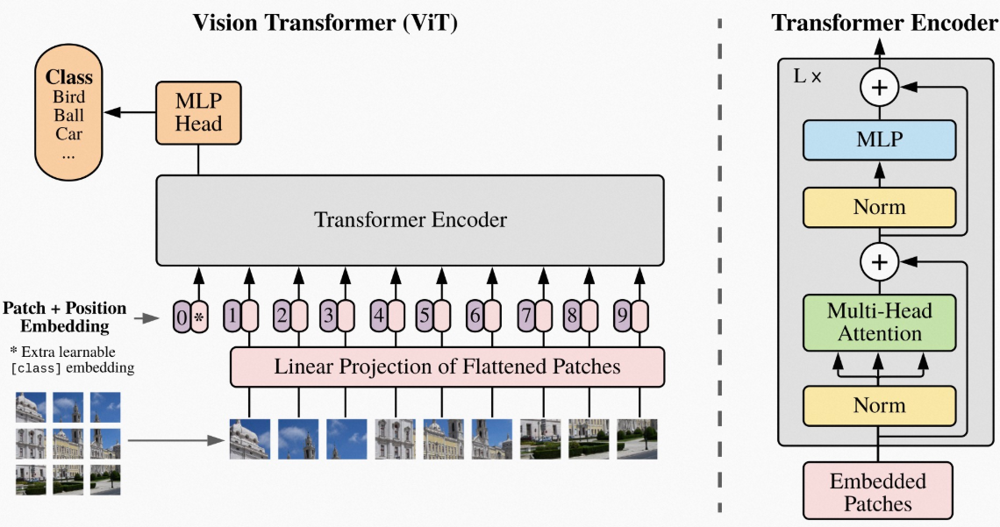

import { Spoiler } from 'astro-pure/user'

## 引言
在快要到2026年的今天, ViT 相比于当下的复杂的结构而言, 已经显得比较简单了, 我读论文的时候的最大感觉是, 它充满了 Transformer 在各领域蓬勃发展的野蛮生长的气息.
但是作为 Transformer 在CV领域的里程碑式的工作, 并且我作为这方面的初学者, 我觉着还是需要读一下这一篇论文[An Image is Worth 16x16 Words: Transformers for Image Recognition at Scale](https://arxiv.org/abs/2010.11929), 做一个简单的记录.

## ViT 的整体结构
ViT 的整体结构如下图所示:

可以看到, 他的特殊处理是在于输入部分, 传统的 CNN 是通过 kernel 来滑动提取局部信息, 这样的一个 CNN 的输出很难直接送入 Transformer 中进行处理, 因为
 Transformer 需要的是一个序列化的输入, 而CNN 的输出是一个三维的 feature map.

因此, 相较于同期的其他处理, ViT 直接将输入图像划分为若干个小的 patch, 然后将每个 patch 展平并映射到一个固定维度的向量空间中, 形成一个序列化的输入, 这样就可以直接送入 Transformer 中进行处理.

- 具体来说, 假设输入图像的尺寸为$H \times W \times C$ (高度, 宽度, 通道数), 我们将其划分为大小为$P \times P$的若干个不重叠的 patch, 则总共会得到$N = \frac{HW}{P^2}$个 patch.
- 每个 patch 被展平为一个向量, 并通过一个线性投影映射到一个$d$维的向量空间中, 形成一个序列化的输入矩阵$X \in \mathbb{R}^{N \times d}$.
- 此外, 为了让模型能够捕捉到位置信息, ViT 还引入了可学习的位置编码, 将其与输入序列相加, 形成最终的输入表示.
- 接下来, 这个序列化的输入就可以直接送入标准的 Transformer Encoder 中进行处理, 经过多层的 Transformer Encoder Layer 的处理后, 得到最终的输出表示.

其具体的一个维数变换大概是这样:
$$
X \in \mathbb{R}^{224 \times 224 \times 3} \rightarrow 196 \times Patchs^{16 \times 16 \times 3} \rightarrow Flattened_Patchs^{196 \times 768} \rightarrow \\
Transformer Input^{197 \times 768} \rightarrow Transformer Output^{197 \times 768} \rightarrow Classifier Output^{1 \times 1000}
$$
为什么新加上的class token work?

- 因为在transformer中, 两两token之间是可以相互attention的, 因此class token可以和所有的patch token进行attention, 从而聚合全局的信息, 这样我们就可以在最终的输出中使用class token来进行分类任务.

## 一些其他的细节
相对于 CNN 而言, ViT 的先验信息很少, 因此在中小数据集上的表现并不理想, 论文中提到需要在大规模数据集上进行预训练, 然后再进行微调, 才能取得较好的效果.

此外, ViT 的 attention 机制也与 Transformer 类似, 主要包括 Multi-Head Self-Attention 和 Feed-Forward Neural Network (FFN) 两个部分, 具体的计算过程与 Transformer 中的 Self-Attention 类似, 这里就不再赘述.

总的来说, ViT 通过将图像划分为 patch 并使用 Transformer 进行处理, 提供了一种新的思路来解决计算机视觉中的图像分类问题, 并且在大规模数据集上取得了优异的表现, 成为计算机视觉领域的重要里程碑.