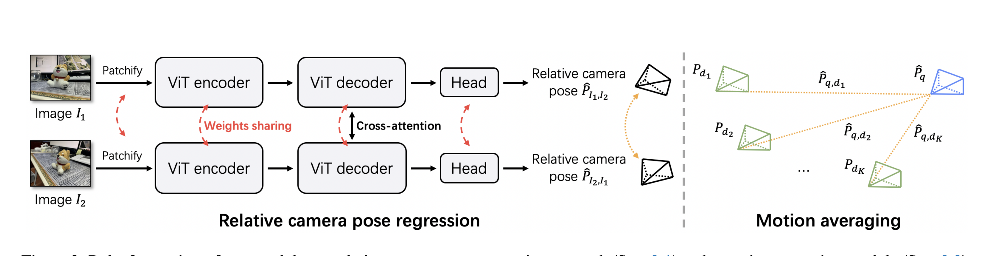
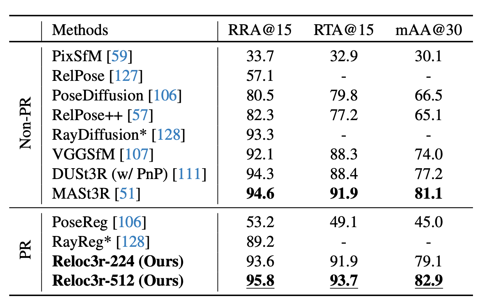
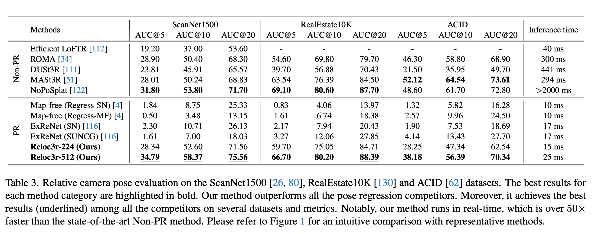
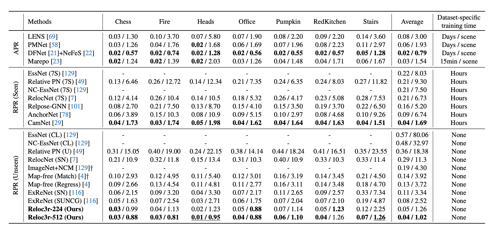
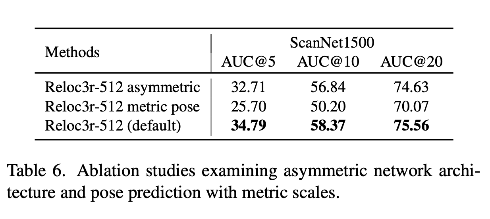
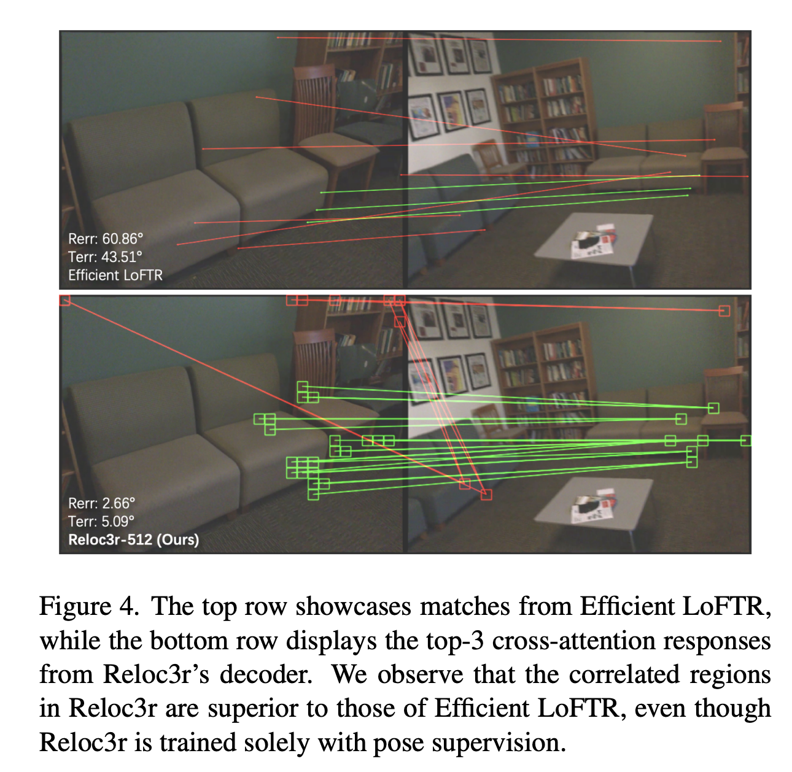

## 引言
最近，我们在尝试将SLAM3R进行使之输出不限于点云，还有位姿估计、深度图、局部定位等结果的改造，大体上来讲，我对这个改造的感觉就是端了一个类似于VGGT的重建结构出来。于是，为了了解一下现在利用transformer做位姿估计的工作，我选择了组里的学长的论文：[Reloc3r: Large-Scale Training of Relative Camera Pose Regression for
Generalizable, Fast, and Accurate Visual Localization](https://github.com/ffrivera0/reloc3r)来阅读，本文用来记录对这个模型的理解以及个人的感受。

首先，论文上来又是经典的针砭时弊环节🤣，论文指出了之前的工作分为**APR**和**RPR**两种方式，但是各有各的缺点：
- APR : 绝对位姿回归，它主要是从图片中直接回归位姿，优点是有更高的推理速度和准确度，但是它的缺点也很明显：大多数这种方法都是针对场景有效，并且在训练时需要密集点图，这限制了他们在真实世界中投入应用。
- RPR : 相对位姿回归：它是估计一对图片的相对位姿，相比于绝对位姿回归的好处在于它不需要密集点图的训练，但是，它的准确度表现非常差，远远不及APR。

为了解决这些问题，论文提出了一种新型的对称有效的网络，并在一个**特大**的数据集上进行训练，最终得到了**state of the art**的水平。

## 模型结构

模型主要由两个模块组成：相对位姿回归网络和运动平均模块

### 相对位姿回归网络
这个网络如图片左边所示，是由两个完全相同的vit transformer分支构成，并且两个分支共享权重，这有效的消除了输入顺序带来的不利影响，代表着训练得到了大幅简化，并且提高了计算速度和存储效率。

细节在于通过ViT encoder图片被编码成特征序列之后，他们之后通过的decoder是Cross attention的，这能够使模型同时理解两张图片之中的信息，最后，decoder输出的信息会经过Pose regression Head
这个head会将decoder的输出转化为相对旋转和相对位移，其中相对旋转一开始会以一个9维向量来表示，随后通过SVD分解完成得到旋转矩阵。

因此，我们这个网络最后的输出就是图A相对于图B的位姿变换和图B相对于图A的位姿变换。

### 运动平均模块
理论上来说，第一步网络的输出的精度应当已经达标，并且网络同时输出的两个相对位姿变换矩阵应该互你，从经验上来看，这两个位姿变换矩阵的精度相似，因此我们直接选择了一个非学习的模块用于转换两个输出的相对位姿。

其中有一些细节：

- 旋转平均的处理：模型将多个对于一张图片的相对旋转转换为绝对旋转处理，并使用四元数表示，最终选取中位数来作为绝对旋转，增强了模型的鲁棒性。
- 相机中心三角化的处理：因为几何点的平均/中位数化并不可解，因此我们转而通过最小二乘法寻找到所有平移方向距离之和最小的点，将这个点作为相机预测的光心。

### 损失函数
模型的损失包括两方面：旋转损失和位移损失。文章将他们都表示成了角度：
$$
\mathcal{l}_R = \arccos(\frac{tr(\hat{R}^{-1}R) - 1}{2}), \mathcal(l)_T = \arccos(\frac{\hat{t} \cdot t}{||\hat{t}||||t||})
$$
然后将两者相加得到最后的总损失。显然这是一种无尺度的方法，解决了不同数据集之间度量尺度不统一的问题。

## 分析流程
该模型的处理流程大致如下：
- 输入： 一个查询图像$I_q$和一个带位姿数据的数据库$\{I_{d_n}\}$.
- 检索： 使用NetVLAD在数据库中为$I_q$检索出Top-K个最相似的图像$\{I_{d_K}\}$.
- 相对位姿预测：将$K$个图像对$(I_q, I_{d_i})$逐一送入相对位姿回归网络，得到$K$个相对位姿估计（旋转矩阵和无尺度的平移方向）
- 绝对位姿聚合：
    - 利用数据库图像已知的绝对位姿旋转和预测的相对旋转计算出$K$个图像的绝对旋转统计，然后通过取中值得到最终的旋转$\hat{R}_q$。
    - 利用所有有效的图像对和估计的$\hat{R}_q$进行相机中心的三角化，然后通过最小二乘法解出相机中心，从而得到所有的位姿估计。
- 输出

## 数据分析
第一次写数据分析模块🧐，有所不完善请原谅🥺。

### 性能评价指标

#### 相对位姿 

- **RRA@15, RTA@15, mAA@30**，分别是相对旋转、相对位移在15°阈值内的准确度、以及30°阈值下的平均准确率。

- **AUC@5°/10°/20°**: 位姿误差（旋转和平移角度误差的最小值）在5°/10°/20°阈值下的精度曲线下面积 。

#### 绝对位姿 
平移和旋转中位数误差（m and degree）：

### 有效性验证
查看上面的图表便可看出，模型在个主流的公开数据集 (ScanNet1500, RealEstate 10K, ACID, CO3Dv2, 7 Scenes, Cambridge Landmarks) 上与当前最先进的方法（包括非回归和回归两大类）进行全面对比：

- **相对位姿估计**: 在ScanNet1500, RealEstate 10K和ACID数据集上，Reloc3r显著优于所有其他相对位姿回归(PR)方法，并且性能达到甚至超过了顶尖的非PR方法，同时速度快了几个数量级（例如，在ScanNet上比NoPoSplat快50倍以上） 。在CO3Dv2数据集上，Reloc3r在所有多视图评估指标上均达到SOTA 。
- **视觉定位**
    - 在7Scenes (室内) 数据集上，Reloc3r的平均误差为 0.04m / 1.02°，超越了所有之前在新场景上评估的RPR方法，并达到了与需要场景专门训练的APR方法相媲美的精度。
    - 在Cambridge Landmarks (室外) 数据集上，Reloc3r同样超越了所有RPR方法，与之前的SOTA RPR方法相比，平均位姿误差降低了约一半，其平均旋转误差甚至优于所有APR方法 。

### 消融实验

- **对称性**
论文另外训练了一个使用了独立的两个ViT分支的相对位姿回归网络，显而易见性能是弱于default版本的

- **不含尺度信息**
同样训练了一个同时输出尺度信息的模型，显而易见其准确性比不对称还差。

## 有趣的发现
论文在查看decoder的交叉熵注意力图时发现：模型在没有直接监督的情况下，自发地学会了在图像对之间建立有意义的块级别匹配。（如下图）

## 局限性
作者发现当检索到的数据库图像与目标图像共线的时候，运动平均模块并不能恢复尺度。

## 总结
Reloc3r使用了一个相当简洁的模型结构完成了SOTA水平，但其付出的代价是非常庞大的训练数据。这似乎在向我们说明只要数据够多够大，我们便可以训练出足够高性能的模型，这似乎在
告诉我们多造一下SLAM3R V2的数据🤣。

OK，这篇论文的代码仓库如下：

import { GithubCard } from 'astro-pure/advanced'

<GithubCard repo='frivera0/reloc3r' />