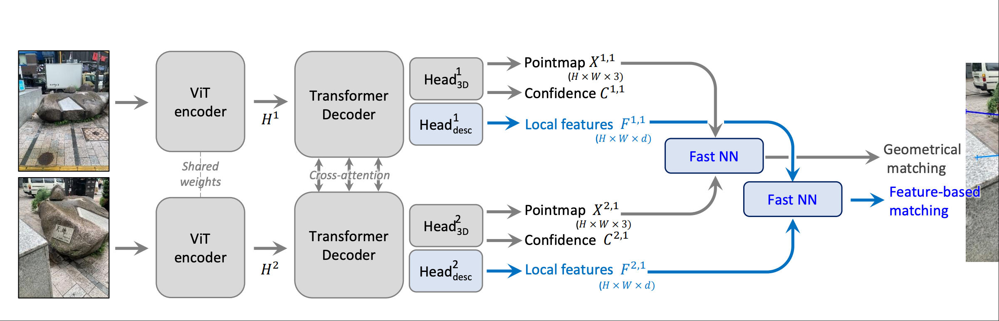
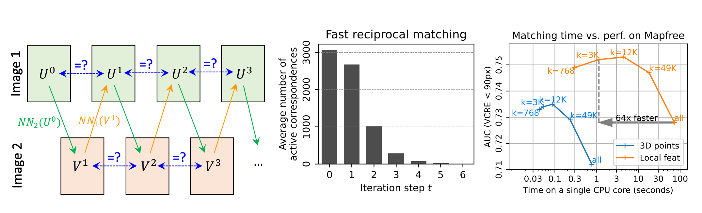

## 引言
经过一周的对[SLAM3R](https://github.com/HJCheng0602/SLAM3R)进行online以及可视化demo改造的低效率劳作且工作完成，我终于有时间来补档我这篇早在近两个周之前就读完的论文[Grounding Image Matching in 3D with MASt3R](https://github.com/naver/mast3r)

读完这篇论文之后，我的第一感觉就是：这是一个DUst3R的修补模型，他并没有太多的像DUst3R那样的开创性地将transformer运用于双目三维重建那样的举动，而是在DUst3R模型上进行了
少许修补，并提出了少许修补中的一些独创性方法，感觉是一篇介绍small trick的论文。同时，我们似乎也可以这么说：MAst3R发现本聚焦于三维重建任务的DUst3R在像素匹配问题上同样达到了SOTA
于是，MAst3R将DUst3R稍加改造，得到了一个在像素匹配上表现更强的模型MAst3R.

## 模型介绍
MASt3R的模型结构与Dust3R大致相同：

### Encoder 
与DUst3R相同，MAst3R的encoder部分同样是由ViT组成的，且与DUst3R相同的是，MAst3R的encoder部分也是共享权重的。
就像这样：
$$
H_1 = Encoder(I^1) \\
H_2 = Encoder(I^2)
$$

### Decoder
MASt3R的Decoder同样采用了cross-attention的机制，这能使得MAst3R能够理解同一像素在不同视角下的信息，有助于后续进行像素匹配。
$$
H'^1, H'^2 = Decoder(H^1, H^2) 
$$

### Heads
对于Dust3R来说，他只有一个head，直接将decoder的输出转化为点图信息和置信度（上图灰色部分）
#### 3D Heads
MASt3R对这个head基本上与DUst3R的head相同，都是将decoder的输出转化为点图信息和置信度。
#### Matching Heads
MASt3R在此基础上又增加了一个head，专门用于像素匹配任务(上图蓝色部分)，这个头部由一个简单的两层的MLP组成，使用了GELU作为激活函数，另外在处理完后进行归一化处理，负责输出两张密集的特征图：
$$
D^1 = Head_{desc}^1([H'_1, H'_2]) \\
D^2 = Head_{desc}^2([H'_1, H'_2])
$$

### Loss
Mast3R的损失函数由两部分组成：
$$
\mathcal{L}_{total}=\mathcal{L}_{conf}+ \beta\mathcal{L}_{match}
$$

#### 3D Loss
MAst3R的3D Loss与DUst3R的3D Loss基本相同，都是由点图的L1损失和置信度的交叉熵损失组成。
但是，MAst3R在计算回归损失的时候，原本的DUst3R计算公式是这样的：
$$
\ell_{\mathrm{regr}}(\nu,i)=\left\|\frac{1}{z}X_i^{\nu,1}-\frac{1}{\hat{z}}\hat{X}_i^{\nu,1}\right\|,
$$
MAst3R 认为在它的应用场景中，并不鼓励尺度不变性，而更多的是需要绝对的尺度一致性，因此MAst3R将上式改为了：
$$
\ell_{\mathrm{regr}}(\nu,i)=\frac{\left\|X_i^{\nu,1}-\hat{X}_i^{\nu,1}\right\|}{\hat{z}}
$$
因此，MAst3R的3D Loss计算公式为：
$$
\mathcal{L}_{\mathrm{conf}}=\sum_{\nu\in\{1,2\}}\sum_{i\in\mathcal{V}^\nu}C_i^\nu\ell_{\mathrm{regr}}(\nu,i)-\alpha\log C_i^\nu.
$$
#### Matching Loss
这个损失函数是对Matching Head输出的特征图进行监督的，基本思想是：我们鼓励一个图像中的一个特征匹配符，最多与另一张图像中代表同一个3D点的特征匹配符进行匹配，
需要注意的是，这个匹配本质上是一个交叉熵分类损失，当网络猜到正确的像素（而非邻近的像素）时，才会得到奖励。

具体实现上，我们利用了InfoNCE loss来实现这个想法，其作用于一组对应关系$\hat{\mathcal{M}} = \{ (i, j)|\hat{X_i}^{1,1} = \hat{X_j}^{2,1} \}$，具体公式如下：
$$
\mathcal{L}_{\mathrm{match}}=-\sum_{(i,j)\in\hat{\mathcal{M}}}\log\frac{s_\tau(i,j)}{\sum_{k\in\mathcal{P}^1}s_\tau(k,j)}+\log\frac{s_\tau(i,j)}{\sum_{k\in\mathcal{P}^2}s_\tau(i,k)}
$$
其中，$s_\tau(i,j)=\exp(\frac{D_i^1\cdot D_j^2}{\tau})$，$\tau$是一个温度参数，$\mathcal{P}^1$和$\mathcal{P}^2$分别是图像1和图像2中所有像素的集合。

这极大地鼓励了网络进行高精度匹配。

最后，两个损失函数被结合起来，形成了MAst3R的总损失函数：
$$
\mathcal{L}_{total}=\mathcal{L}_{conf}+ \beta\mathcal{L}_{match}
$$
有了上述模型与Loss就可以训练了，但是网络的输出还需要经过一些处理，才能得到需要的匹配关系。注意，网络只输出了PointMap和每个像素的LocalFeature，而期望得到的是两个图像之间的像素点级别的匹配，匹配相关的部分就是图中新增的NN模块。

## 快速互惠匹配
当给定两张特定的预测图$DD^1,D^2\in\mathbb{R}^{H\times W\times d}$时，我们的目标是提取一组可靠的像素对应关系，即互惠最近邻。

数学定义：
- 互惠最近邻集合由公式定义：
$$
\mathcal{M}=\{(i,j)|j=\mathrm{NN}_2(D_i^1)\mathrm{~and~}i=\mathrm{NN}_1(D_j^2)\}
$$
- 这里的$NN_A(D_j^B)$表示在特征图$D^A$中与特征$D_j^B$距离最近的特征的索引。其数学定义为：
$$
\mathrm{NN}_A(D_j^B)=\arg\min_i\|D_i^A-D_j^B\|
$$

### 传统方法
传统上，计算互惠最近邻的方法是通过暴力搜索来实现的，这种方法的时间复杂度为$O((HW)^2)$，这在高分辨率图像中是不可行的。

虽然优化最近邻搜索是可能的，例如使用 **K-d** 树，但这种优化在高维特征空间中通常会变得非常低效，在某些情况下，其速度甚至比 MASt3R 输出$D_1$和$D_2$的推理时间慢几个数量级。
### MASt3R的方法
MASt3R 提出了一种基于**子采样***的快速方法。

这个方法是从一个稀疏的第一张图片的像素集合出发的，通过找到这个集合中每个像素在第二张图片上的最近邻得到最近邻集合，然后再从这个最近邻集合中找到每个像素在第一张图片上的最近邻，最后通过检查互惠性来得到最终的互惠最近邻集合。

整个过程可以表示为：
$$
U^t\mapsto[\mathrm{NN}_2(D_u^1)]_{u\in U^t}=V^t\mapsto[\mathrm{NN}_1(D_v^2)]_{v\in V^t}=U^{t+1}
$$

* 当 $U_n^t = U_n^{t+1}$ 时，这些像素形成了一个闭环，并被收集为一组**互惠匹配** $\mathcal{M}_k^t = \{ (U_n^t, V_n^t) | U_n^t = U_n^{t+1} \}$。
* 对于下一次迭代，那些已经收敛的像素（即 $U_n^t = U_n^{t+1}$）会被过滤掉，新的 $U^t$ 更新为 $U^{t+1} \setminus U^t$。
* 这个过程会迭代固定的次数，直到所有的对应关系都收敛到稳定的（互惠）对为止。
* 最终的输出对应关系集合 $\mathcal{M}$ 由所有互惠匹配集合的拼接而成：$\mathcal{M} = \bigcup_t \mathcal{M}_k^t$。

这种快速匹配算法的总体复杂度大概是$O(kWH)$，相比朴素方法的$O((WH)^2)$，有了显著的提升。

具体证明过程可以参考论文的附录部分。

## 个人总结
MAst3R这篇论文的阅读，本人自己对mast3r的理解，以及对transformer在三维重建任务中应用的理解，基本上就到这里了，当然，mast3r的实验部分我并没有过多地去阅读，因为我觉得mast3r的实验部分并没有太多的创新性，基本上都是在验证mast3r在各个任务上都达到了SOTA的水平。
我个人觉得mast3r的创新点主要有以下几点：
1. 在DUst3R的基础上，增加了一个匹配头，用于像素匹配任务，这个头部的设计比较简单，但是效果却非常好。
2. 在3D损失函数中，改变了点图回归损失的计算方式，使其更加适合绝对尺度一致性的任务。
3. 提出了一个快速的互惠匹配算法，大大提升了匹配的效率。
总的来说，MAst3R是一篇比较实用的论文，通过一些小的改动和创新，使得模型在多个任务上都达到了SOTA的水平，值得学习和借鉴。

另外，MAst3R的代码也已经开源：

import { GithubCard } from 'astro-pure/advanced'

<GithubCard repo='PKU-VCL-3DV/SLAM3R' />
喵喵补坑完毕，虽然感觉说了和没说一样😭