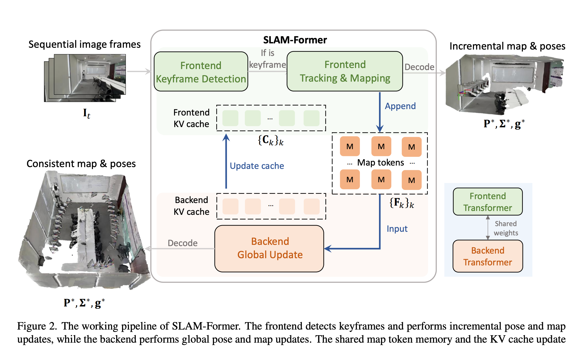
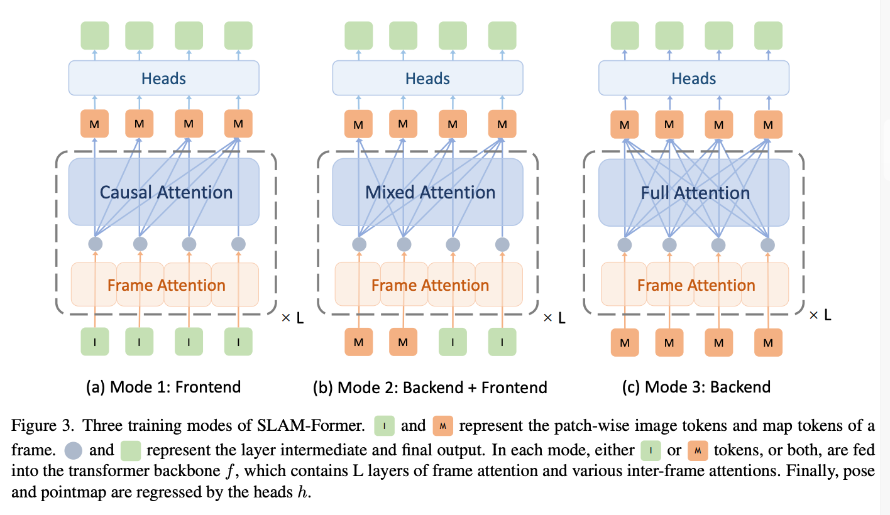
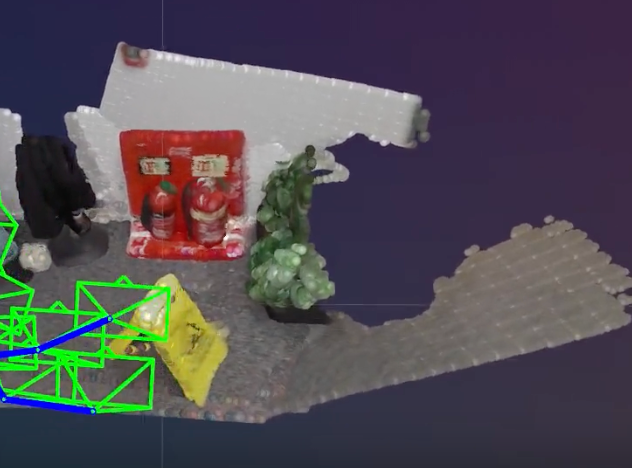

import { Spoiler } from 'astro-pure/user'

## 引言
最近几天读了[SLAM-Former: Putting SLAM into One Transformer](https://arxiv.org/abs/2509.16909)这篇很近很近的工作，本文笔记记录用于后续翻阅学习

首先，SLAM-Former与之前读到的所有论文相似，都是致力于从RGB图像序列中恢复三维场景结构和相机位姿等属性的工作。但是与之前的工作（包含一个冗长复杂的pipeline）不同，
SLAM-Former对已有的transformer架构进行了大胆的改进，使之更适合进行重建任务，并在实验中得到了competitive的结果。

## 模型结构

据作者所述， SLAM-Former的主要pipeline由frontend和backend两部分组成，至于模型的backbone，SLAM-Former建立在一个Transformer架构之上，
而这个Transformer aggregate了intraframe和interframe的信息，并使用task specific heads预测不同的三维属性。
值得注意的是， 这个Transformer的输入与$\pi^3$类似，对所有的输入的image token共享一个相同的register tokens
从而使模型不依赖于一个不稳定的reference frame。

模型的backbone包含了$L$层组合了intra-frame attention和inter-frame attention
来联合捕捉图像内容和图像之间的关系。

此外，Front end部分负责增量式的逐帧重建，back end负责全局的点云对齐和相机优化，他们共享一个
Transformer backbone。

### Front end
图中大部分内容都是front end的处理细节，当一个新的frame输入时，frontend首先会
决定其是否为keyframe，如果是的话，则会进行进一步处理。

当给定一个frame sequence时，frontend将每一个frame映射到一个map token集合中：
$$
\mathbb{F}_t = f_{fn}(\mathbb{I}_t)_{\{C_k \}_{K\in S}}
$$
这里, $\{C_k\}_{K\in S}$表示之前keyframe的**KV cache**，
， $S$代表着keyframe的索引集合，$F_t$是当前frame的map token, 作为该frame的
一个隐式神经表示。 同时新的KV cache也通过$C_t = Cache(f(\mathbb{F}_t))$产生，
也会视情况被扩充到$\{C_k\}_{K\in S}$中。

#### Keyframe detection
在上一步中我们已经对当前帧generated了map token，接下来我们需要决定是否为keyframe.

作者采用了pose head来预测当前帧的pose：
$$
g_t = h_{pose}(\mathbb{F}_t)
$$

当当前frame的relative pose与最近的keyframe的pose之间的差异大于一个阈值时，
则将当前frame标记为keyframe。

但是作者在论文里又表明，在检测frame是否为keyframe时，他们并没有依赖KV cache
,而是直接应用了$f_{fn}(I_{k_{prev}}, T_t)$来检测，就相当于之前的KV cache是将该图片
与所有的keyframe进行attention计算，而这里则是只与最近的keyframe进行attention计算。
这样增加了效率并且避免了选取一个特定的reference frame。（这里似乎我没怎么懂跟特定的reference frame有什么关系）

#### Front end tracking and mapping
接着上一步，如果一个新的frame已经被认为是一个keyframe，我们就可以重新利用全部的KV cache来重新
计算他的map token, 并更新M, S.

好了， front end 到这里差不多结束了，作者说frontend只依赖于过去的keyframe， 
使得其适合于online的tracking，然而， 这种处理顺序会导致误差累积和局部不一致，
为了解决这一问题，作者引入了一个back end模块来进行global refinement.

### Backend
Backend的主要任务是refine所有的frame来达到全局的一致性。传统的
SLAM系统通常会使用loop closure和bundle adjustment来实现这一点，
但是这些方法都非常的costly, 作为对比，作者使用了一个transformer-based的
back end来进行全局的优化。

作者认为这个设计的有效性在于backend transformer内部的full attention机制，
他的全局感受野使得模型能够完成误差纠正和结构一致性。

此外， 为了继承backend refinement的优势，frontend和backend共享了KV cache，
使得frontend能够受益于backend的全局优化。

## Training Strategy
与以往的一些论文不同，SLAM-Former的创新点不止在于模型架构，也在于一些训练策略。

作者的目标是使一个transformer同时胜任frontend和backend的任务，为了达到这个目标，
作者用三种模式联合训练，每一个模式都对应着不同的输入输出对。

### Training Frontend 
Frontend用了一个causal mask来确保每一个frame只能访问之前的keyframe。

然而，纯净的使用causal mask会自动的将第一帧作为reference frame，
作者又注意到党对两帧或更多帧进行联合操作时，没有单一的refernce frame,
这避免了后续帧需要与reference frame pose 相似的要求。

因此， 作者对前两帧使用了full attention，并同时对所有后续frame使用causal mask,
在这种情况下，inference时，keyframe detection将最后一帧关键帧和当前的输入帧进行处理，
tracking and mapping时， 前两个keyframe则会联合处理决定全局坐标。

import { Aside, Tabs, TabItem, MdxRepl } from 'astro-pure/user'

<Aside type='note' title='疑问'>
作者的原文是：

>For tracking and mapping, the
first two keyframes are jointly processed to determine the
global coordinate.

取前两帧的做法与之前的tracking and mapping部分提到的use full KV cache不符，
我感觉不怎么理解。
</Aside>

### Training Frontend with Backend Cooperation
为了在frontend和backend之间建立联系，作者使用maxed attention来模拟backend和
cache sharing的过程。

具体来说，采用混合注意力在一个统一的正向传播中同时完成地图精炼（后端/全注意力）和新数据处理，
并且前端的casual attention并非独立工作，而是以KV cache为条件，实现了高效且信息流一致的前端-后端协作，确保前端的实时处理结果能够立即对齐到后端修正后的全局结构。

$$
F = f_{fn}(I)_{C_{M}}
$$

<Spoiler>woc这什么花式操作啊</Spoiler>

### Training Backend
作者最后使用full attention来训练backend transformer，

## Joint Training
在所有的三种模式中，三维属性均是由task specific heads 预测的：

$$
\mathbf{P}^*,\mathbf{\Sigma}^*,\mathbf{g}^*=h(\mathbf{F}).
$$

但值得注意的是， 并不像其他的工作一样，SLAM-Former只预测每一帧的local 
pointmap 来避免设定一个特定的世界坐标系的需求，这倒是与$\pi^3$非常相似。

剩下的loss函数都比较常规。
这三种模式都会在一个batch中共享权重依次训练。

## Pipeline 
在图片和叙述过程中， pipeline已经是显而易见的，于是我便不再赘述。

## Experimental Setup 
本模型有36层framewise 和 global attention相结合的transformer layer, 训了10个
epoch, 在32个A100 上训练了11小时。可以可以。

## results
模型在pose， tracking 和 reconstruction等任务上都达到了很好的指标。数据冗长不再多说。
值得一提的是作者对Front end 和 back end 的联系的理解。

back end assist front end无疑是显而易见的，但是作者还发现back end同样也
benefit from front end, 作者解释了是因为back end 使用了来自于frontend 的 
implicit的顺序信息，从而使得back end能够更好地理解frame之间的关系。（迷）

## 总结
总之，SLAM-Former通过对transformer架构的改进和训练策略的设计，
成功地实现了一个统一的模型来处理SLAM任务。

但SLAM-Former仍然存在一些局限性，比如说作者用full attention来替代传统的loop
closure和bundle adjustment，受限于full attention的计算复杂度，模型难以处理非常长的序列，
其次，frontend 不支持一个local的inference， 因为在inference之前需要将所有的KV cache输入到frontend 中。

此外， 文章中没有提到的是，我去看他们的demo， 发现重建结果有很明显的分块化现象，目前不知是否与transformer的架构有关。

此文撰写的时候，SLAM-Former的代码尚未开源，期待后续的代码发布。

import { GithubCard } from 'astro-pure/advanced'

<GithubCard repo='Tsinghua-MARS-Lab/SLAM-Former' />

