import { Spoiler } from 'astro-pure/user'

## 引言
Transformer 在[Attention is All You Need](https://arxiv.org/abs/1706.03762)一文中被提出, 本来想读一下原文的, 但是时间并不太够, 因此我们这里就简单捋一下就行.

## 整体结构
Transformer 的整体结构如下图所示:

可以看到, 其主要由 Encoder 和 Decoder 两部分组成.

- Transformer 的工作流程:
    - 首先获取输入每一个词的表示向量$X$, $X$由单词的embedding和位置的embedding相加得到.
    - 然后将$X$输入到Encoder中, 经过多层的Encoder Layer的处理, 得到编码后的表示$Z$.
        - $Z$用$X_{n \times d}$表示, 其中$n$是序列长度, $d$是词向量的维度.
    - 接着将目标序列的输入$Y$输入到Decoder中, 经过多层的Decoder Layer的处理, 并结合Encoder的输出$Z$, 最终得到预测结果$\hat{Y}$.如下图:

        - 使用的过程中, 翻译到单词$i + 1$时, 需要通过**Mask**操作掩盖住未来的信息, 以防止模型在预测时看到未来的词.
    
OK, 下面我们来具体看看Encoder Layer和Decoder Layer的结构.

## Self-Attention 机制
Transformer 的核心是 Self-Attention 机制, 其结构如下图所示:

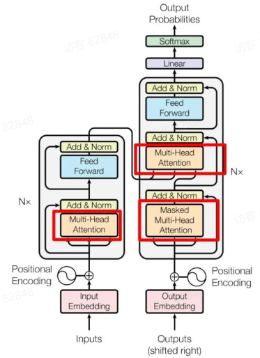

- 左侧为**Encoder block**
- 右侧为**Decoder block**
- 红圈中的部分为**Multi-Head Attention**机制, 是由多个Self-Attention组成的.

1. 可以看到**Encoder block**包含一个**Multi-Head Attention**层.
2. **Decoder block**包含两个**Multi-Head Attention**层, 第一个用于处理目标序列的输入, 第二个用于结合Encoder的输出.
3. 每个Attention层后面都跟着一个**Feed-Forward Neural Network (FFN)**层.

因为**Self-Attention**机制是Transformer的核心, 因此我们重点来看一下它的计算过程.

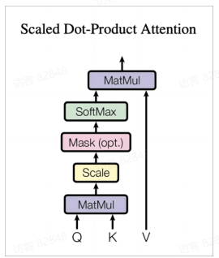

上图是**Self-Attention**的计算流程图, 计算时需要用到三个矩阵: Query ($Q$), Key ($K$), Value ($V$), 实际过程中, 这三个矩阵都是通过输入的表示$X$经过线性变换得到的.

### Q, K, V 的计算
**Self-Attention**机制中, 对于输入的表示$X \in \mathbb{R}^{n \times d}$, 可以使用线性变换矩阵$W_Q, W_K, W_V \in \mathbb{R}^{d \times d_k}$来计算$Q, K, V$:
$$
Q = X W_Q, \quad K = X W_K, \quad V = X W_V
$$

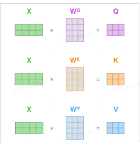

#### 实现
```python
import numpy as np
from math import sqrt
import torch
import torch.nn as nn


class SelfAttention(nn.Module):
    def __init__(self, d_model, d_k, d_v):
        """
        input: X : (batch_size, n, d_model)
        q : (batch_size, n, d_k)
        k : (batch_size, n, d_k)
        v : (batch_size, n, d_v)
        """
        super(SelfAttention, self).__init__()
        self.d_k = d_k
        self.W_Q = nn.Linear(d_model, d_k)
        self.W_K = nn.Linear(d_model, d_k)
        self.W_V = nn.Linear(d_model, d_v)
        self._norm_factor = sqrt(d_k)
    
    def forward(self, X):
        Q = self.W_Q(X)  # Q : (batch_size, n, d_k)
        K = self.W_K(X)  # K : (batch_size, n, d_k)
        V = self.W_V(X)  # V : (batch_size, n, d_v)
        
        scores = torch.matmul(Q, K.transpose(-2, -1)) / sqrt(self.d_k)  # (batch_size, n, n)
        attn_weights = torch.softmax(scores, dim=-1)  #  (batch_size, n, n)
        output = torch.matmul(attn_weights, V)  # (n_batch_size, n, d_v)
        
        return output
```

因此, 当我们得到了$Q, K, V$后, 就可以计算Attention的输出了:
$$
\text{Attention}(Q, K, V) = \text{softmax}\left(\frac{Q K^T}{\sqrt{d_k}}\right) V
$$

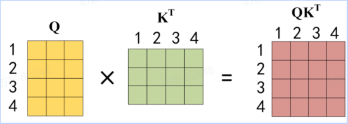

得到$QK^T$之后, 使用Softmax函数对每一行进行归一化, 即每一行的和都变为1.

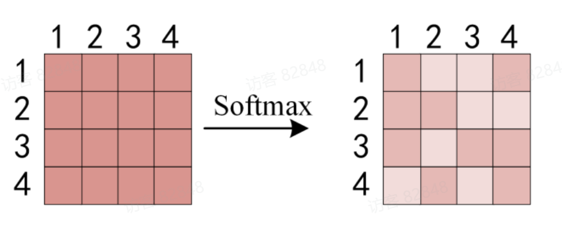

最后将归一化后的权重矩阵与$V$相乘, 得到最终的Attention输出.

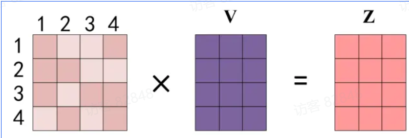

上图中**softmax**矩阵的第一行可以理解为单词1对其他单词的关注程度, 最终单词1的输出$Z_1$等于所有单词的值$V$加权求和.

### Multi-Head Attention
上一步中, 我们已经知道怎么使用Self-Attention机制来计算Attention的输出了, 但是Transformer中使用的是**Multi-Head Attention**机制, 其结构如下图所示:

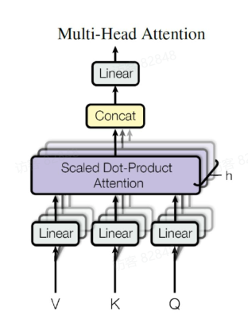

从上图中可以看到**Multi-Head Attention**机制包含多个并行的Self-Attention头, 每个头都有自己的一组线性变换矩阵$W_Q^i, W_K^i, W_V^i$.

首先将输入$X$分别传递到h个Self-Attention头中, 得到h个不同的Attention输出, 下面是h = 8的例子:
```python
from math import sqrt
import torch
import torch.nn as nn

class MultiHeadAttention(nn.Module):
    def __init__(self, d_model, d_k, d_v, h):
        """
        input: X : (batch_size, n, d_model)
        q : (batch_size, d_model, d_k)
        k : (batch_size, d_model, d_k)
        v : (batch_size, d_model, d_v)
        """
        super(MultiHeadAttention, self).__init__()
        self.h = h
        self.d_k = d_k
        self.d_v = d_v
        
        self.W_Q = nn.ModuleList([nn.Linear(d_model, d_k) for _ in range(h)])
        self.W_K = nn.ModuleList([nn.Linear(d_model, d_k) for _ in range(h)])
        self.W_V = nn.ModuleList([nn.Linear(d_model, d_v) for _ in range(h)])
        self.linear = nn.Linear(h * d_v, d_model)
    
    def forward(self, X):
        heads = []
        for i in range(self.h):
            Q = self.W_Q[i](X)
            K = self.W_K[i](X)
            V = self.W_V[i](X)
            
            scores = torch.matmul(Q, K.transpose(-2, -1)) / sqrt(self.d_k)
            attn_weights = torch.softmax(scores, dim=-1)
            head = torch.matmul(attn_weights, V) # (batch_size, n, d_v)
            heads.append(head)
        
        concat_heads = torch.cat(heads, dim=-1)  # (batch_size, n, h * d_v)
        output = self.linear(concat_heads)  # (batch_size, n, d_model)
        
        return output
```

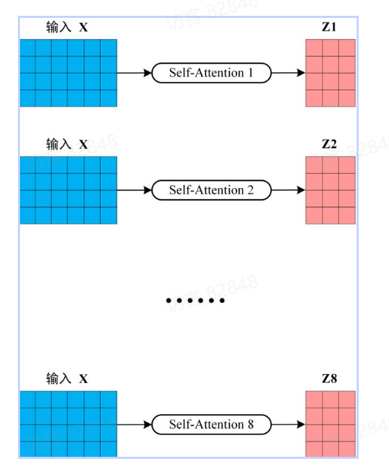

得到8个输出后, 将它们在最后一个维度上进行拼接, 得到一个新的表示, 然后通过一个线性变换矩阵$W_O$将拼接后的表示映射回原始的维度$d_{model}$.

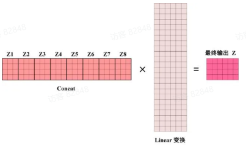

可见**Multi-Head Attention**输出的矩阵维度与输入矩阵的维度相同, 这样就可以方便地将其与后续的层进行连接.

### other components
剩余的层比较简单, 因此不再赘述.

## Decoder Layer
Decoder Layer的结构如下图红框内所示:

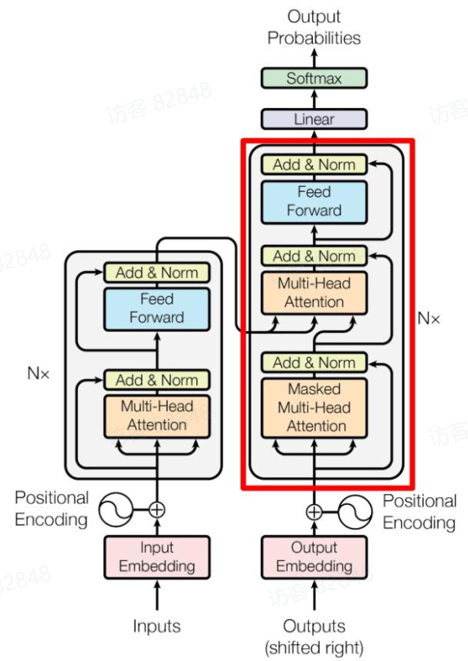

其与Encoder Layer的主要区别在于多了一个**Masked Multi-Head Attention**层, 该层用于处理目标序列的输入, 并且在计算Attention时会掩盖住未来的信息, 以防止模型在预测时看到未来的词.

### 第一个Multi-Head Attention
我们重点解释一下Mask操作.

1. 第一步是Decoder的输入矩阵和Mask矩阵, Mask矩阵是一个上三角矩阵, 用于掩盖未来的信息.
2. 接下来的操作和之前的Self-Attention机制类似, 通过输入矩阵计算$Q, K, V$., 之后计算$QK^T$.
3. 然后将Mask矩阵应用到$QK^T$上, 将被掩盖的位置设置为负无穷大, 这样在Softmax计算时, 这些位置的权重会变为0.

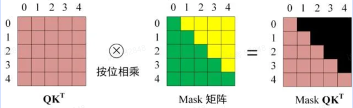

4. 最后进行Softmax归一化, 并与$V$相乘, 得到最终的Attention输出.

### 第二个Multi-Head Attention
第二个Multi-Head Attention层与Encoder Layer中的Multi-Head Attention层类似, 只是这里的$K$和$V$来自于Encoder的输出$Z$, 而$Q$来自于第一个Attention层的输出.

根据Encoder的输出$C$计算得到$K$和$V$, 根据上一个Attention的输出$D$计算得到$Q$, 然后计算Attention的输出.

## 时间复杂度分析
Transformer 的时间复杂度主要来自于 Self-Attention 机制. 对于一个长度为$n$的序列, Self-Attention 的时间复杂度为$O(n^2 \cdot d)$, 其中$d$是词向量的维度. 这是因为在计算$QK^T$时, 需要进行$n \times n$的矩阵乘法, 每个元素的计算涉及到$d$维的向量点积.
因此, 对于一个包含$L$层Encoder和Decoder的Transformer模型, 总的时间复杂度为$O(L \cdot n^2 \cdot d)$.

## 总结
Transformer 应该是这样的.