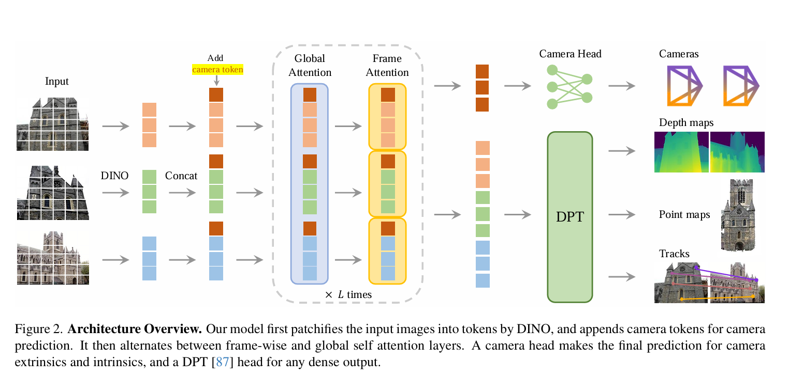
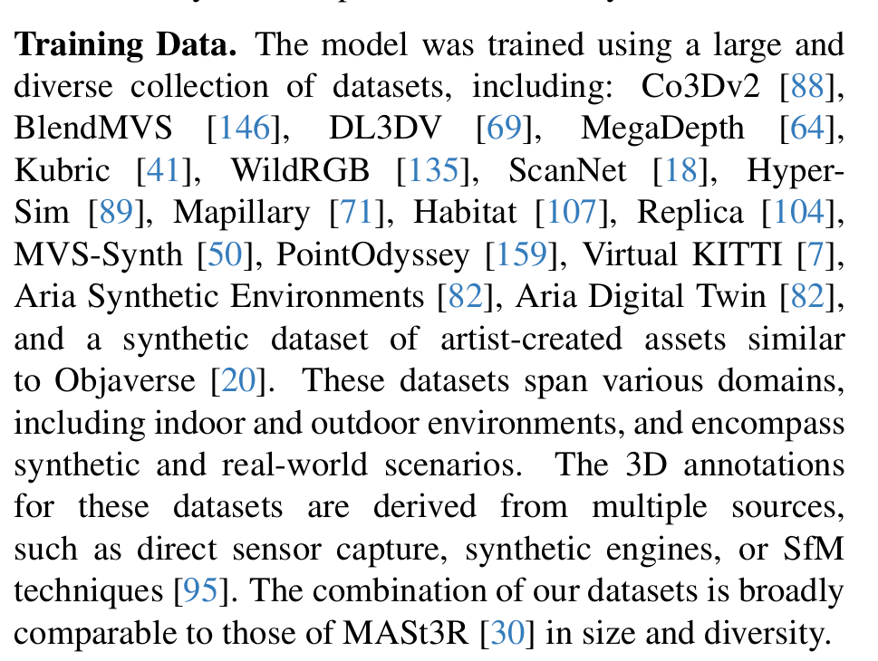
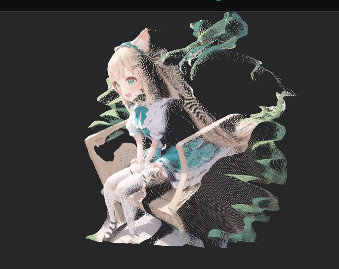

import { Spoiler } from 'astro-pure/user'

## 引言
这是本人在学了一些基础知识并做了一些实验之后, 察觉到之前对于一些经典论文的阅读并不充分, 于是决定重新阅读[VGGT](https://jytime.github.io/data/VGGT_CVPR25.pdf)一文, 并写下这篇文章, 以供后续查阅.

首先, VGGT是一个完全的前馈式神经网络用于多目重建任务, 通过look into他的代码, 可以看到基本上是没有什么pipeline的, 直接将图片输入网络, 然后输出各种三维属性, 并在作者的宣称下, 他们所预测的多个指标在存在BA的前提下
均达到
子领域的SOTA水平, 这一点非常厉害.

## 模型结构
VGGT的backbone是一个标准的transformer结构, 首先接受大量图片作为输入, 首先通过一个DINO提取了分块的feature, 然后将这些feature通过一个主体网络结构(包含了Alternating frame-wise layer和global attention layer)
进行处理, 最后通过多个task-specific heads输出不同的三维属性.

接下来, 我们详细叙述各个细节部分:

### Alternating attention frame-wise layer
据文章作者所述, 该AA机制与标准的transformer attention机制有所不同, 能够使Transformer以交替的方式聚焦每一帧和全局.
- frame wise attention layer: 该层的attention仅在同一帧内进行, 也就是说, 每个patch只能与同一帧内的其他patch进行attention计算. 这样做的好处是能够更好地捕捉每一帧内部的局部特征.
- global attention layer: 该层的attention在所有帧之间进行, 也就是说, 每个patch可以与所有帧内的其他patch进行attention计算. 这样做的好处是能够捕捉不同帧之间的全局特征.

另外值得一提的是, 作者采用了$L = 24$层的AA机制, 并通过消融实验证明了AA机制的有效性, 此外, 作者声称他们的架构并没有采用cross attention, 只采用self attention.

### 任务特定的heads
将输入的图片通过backbone网络处理后, 会得到一个全局的feature表示, 然后通过多个task-specific heads输出不同的三维属性. 值得注意的是, DINO编码的feature并非直接输入到AA中, 而是被添加了一个额外的相机token
$t_i^g \in \mathbb{R}^{1 \times C}$和四个register tokens$t_i^R \in \mathbb{R}^{4 \times C}$进行增强, 然后将$(t_i^L, t_i^g, t_i^R)$作为最终的输入. 

此处值得注意的是, 第一帧的输入token是$(t_1^g = t_{ini}^g, t_1^R = t_{ini}^R)$, 之后的帧的输入token是$(t_i^g = t_{follow}^g, t_i^R = t_{follow}^R)$, 也就是说, 第一帧和之后的帧的camera token和register token是不同的.
但是作者说他们都是learnable的. 这使得模型能够将第一帧和其他帧区分开来, 并在第一个相机的坐标系下表示全局点云以及各种数据.但是, 经过AA层之后, 本来被赋予同一初值的camera token和register
 token均会变为帧特定的, 这是因为AA层的frame-wise attention layer会使得每一帧的token在不同的计算中产生不同的表示.

最后遵循常规做法, register token会被丢弃, camera token和image token会被保留用于预测.

#### Camera parameter head 
这个head从上图中的模型的backbone就可以看到, 他是将camera token通过4个self-attention layers进行处理, 然后通过一个MLP预测出每一帧的相机参数(包含内参和外参).

#### Dense Prediction
输出的image token 在这里被使用, 用于预测depth map $D_i$, point map $P_i$ 和 tracking features $F_i$. 更具体地来讲, $\hat{t}_i^I$首先会通过一个DPT head转化为一个dense feature map
$F_i \in \mathbb{R}^{C'' \times H \times W}$, 之后每一个$F_i$会通过一个$3 \times 3$的卷积层解析出corresponding depth和point map. 另外, DPT头同样也会输出 dense feature map $T_i$用于后续的tracking,
在此同时, vggt同样也会输出confidence map $\Sigma_i^D \in \mathbb{R}^{C \times H \times W}$和$\Sigma_i^P \in \mathbb{R}^{C \times H \times W}$用于表示depth和point的置信度. 这个置信度用于后续的模型的loss计算和
真实预测时的conf输出.

#### tracking
这一方面我并不打算去深入了解, 因此先跳过.

## Training

### Loss function
VGGT的loss function包含多个部分, 主要包含以下几种:
- Camera loss: 这个loss监管了相机参数$L_{camera} = \sum_{i=1}^{N} ||\hat{g}_i - g_i||_{\epsilon}$, 使用了Huber loss.
- Depth loss: 这个loss沿用了dust3r的loss设计$\mathcal{L}_{\mathrm{depth}}=\sum_{i=1}^N\|\Sigma_i^D\odot(\hat{D}_i-D_i)\|+\|\Sigma_i^D\odot(\nabla\hat{D}_i-\nabla D_i)\|-\alpha\log\Sigma_i^D$
- Point loss: 这个loss同样沿用了dust3r的loss设计$\mathcal{L}_{\mathrm{point}}=\sum_{i=1}^N\|\Sigma_i^P\odot(\hat{P}_i-P_i)\|+\|\Sigma_i^P\odot(\nabla\hat{P}_i-\nabla P_i)\|-\beta\log\Sigma_i^P$
- Tracking loss: 这个loss监管了tracking feature的质量, 具体细节我并不打算深入了解, 因此先跳过.

因此, 最终的loss function为:
$$
\mathcal{L}_{total} = \mathcal{L}_{camera} + \mathcal{L}_{depth} + \mathcal{L}_{point} + \lambda_{tracking} \mathcal{L}_{tracking}
$$

### 坐标Normalization
如果缩放的话, 重建结果应该同样也是正确的, 为了消除这种不确定性, 作者采用了归一化进行处理. 首先将所有量表示在第一个相机的坐标系中, 然后计算所有点的平均欧氏距离, 然后利用该尺度归一化相机平移, 点云坐标和深度值.

值得注意的是, 作者没有对预测结果施加任何归一化, 相反强制模型去学习预测归一化后的值, 这样做的好处是能够使得模型更好地适应不同尺度的场景.

### details
我难以想象训练的规模, 按照作者所述, 这一个transformer模型包含了$1.2B$的参数, 在64块A100上训练了9天, 属实是第一次见了.

另外, 训练的数据集之多也是难以想象:

有点离谱了.

## 结论
vggt 的指标基本上达到SOTA水平, 但是值得注意的是, 直接的输出并没有达到, 作者加入了BA优化之后才达到了SOTA, 因为BA是一个costly的优化过程, 因此我觉着这一方面或许还可以改进? 作者在论文中提到了
应用diffentiable BA的可行性, 但是也因为BA的计算量过大, 因此并没有进行进一步的尝试.

此外, VGGT向我们展示了不需要一个复杂的pipeline也可以进行高质量的多目重建<Spoiler>说你呢, SLAM3R, 我TM的快改吐了</Spoiler>, 再结合最近发布的SLAM Former, 我觉着这是一个很有意义的方向.

import { Aside, Tabs, TabItem, MdxRepl } from 'astro-pure/user'

<Aside type='caution' title='忘记了()'>
非常重要的是, vggt证明了联合预测多个任务是有益的, 虽然并没有在loss阶段进行互相的监督, 但是通过多个任务的单独监督, 使得模型学到了更好的表示,

此外, vggt另一个重要的发现是, 通过depth和pose反解出来的点云比直接预测的点云要好.
</Aside>

ok, 让我们把仓库链接抬出来:

import { GithubCard } from 'astro-pure/advanced'

<GithubCard repo='facebookresearch/vggt' />

另外, 这是真的可以的嘛?

