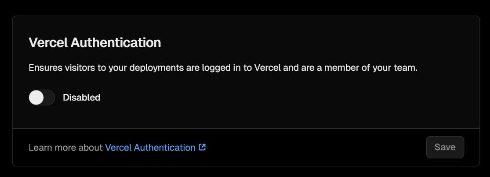

## 引言
在配置本博客时，按照`docs`中给的方法配置waline评论系统完成后，尝试使用却发现总是报`Fail to fetch`错误，尝试到网上搜索解决方案发现全是重新填写
`LEAN_ID`..之类的方法，本人按照这些方法逐一试过之后发现均未能解决问题，经过一系列的排查后，发现问题出在**Vercel**服务端。

## 解决方法
请查看您对应的vercel服务设置中的**Vercel Authentication**选项，如果开启的话，关闭之后就可以正常使用评论系统了：

这一个方法解决的是：控制台-网络中fetch失败的现象。

另外，如果仍然不好，在对应网页页面按下F12打开控制台，如果网络一项没有相关报错而控制台中出现了水合失败之类的报错，这时候就可以编辑本地文件来规避错误了。

这篇有点太水了（x，但是这个评论的bug属实是困扰了我好长时间啊，前前后后搭进去的时间快20小时了哼。
